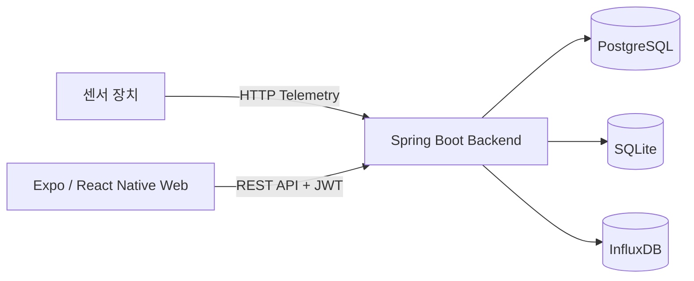
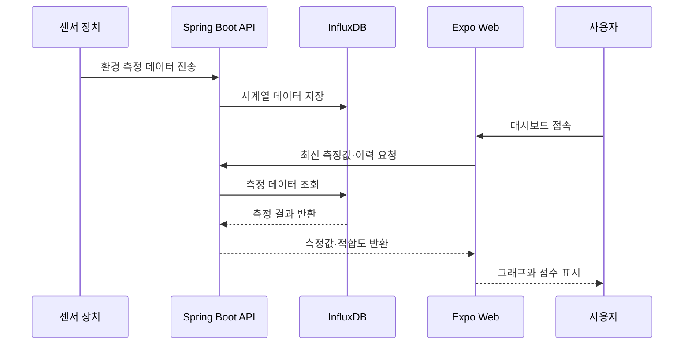

# TerraByte

### 1. 프로젝트 소개

#### 1.1. 개발배경 및 필요성

기후 위기와 식량 안보 문제로 스마트팜이 주목받고 있으며, 옥상·지하 공간·공실과 같은 도심 유휴 공간을 농업 생산 공간으로 활용하려는 시도가 늘고 있습니다. 그러나 기존 스마트팜 솔루션은 구축 이후의 환경 제어와 모니터링에 집중하는 경우가 많아, 설비 투자 전에 후보 공간이 작물 재배에 적합한지 판단하기 어렵습니다.

공간 특성을 충분히 고려하지 않은 설비 투자는 초기 비용과 에너지 사용량을 증가시킬 수 있습니다. TerraByte는 스마트팜 설치 전 환경 데이터를 수집하고 작물별 기준과 비교하여 공간의 적합성을 진단하며, 설치 후에도 같은 플랫폼에서 재배 환경을 지속적으로 확인할 수 있도록 개발한 서비스입니다.
<br/>

#### 1.2. 개발목표 및 주요내용

TerraByte의 목표는 도심 유휴 공간의 스마트팜 전환 가능성을 데이터로 진단하고, 구축 이후의 환경 모니터링까지 연결하는 것입니다.

- 단일 하드웨어 키트에서 대기 온습도, PPFD, 토양 온도, 토양 수분을 측정
- 센서 장치가 측정한 온도, 습도, 광량(PPFD), 토양 수분 등의 환경 데이터 수집
- 수집한 측정값과 작물별 권장 생육 범위를 비교한 환경 적합도 계산
- 사용자, 재배 공간, 장치, 화분 정보를 연계한 통합 관리
- 최신 센서값과 측정 이력을 확인할 수 있는 웹 대시보드 제공
- 토양 프로필을 기반으로 한 추천 정보 제공
- 복잡한 환경 데이터를 점수, 그래프, 색상과 관리 지침으로 변환하여 비전문가의 재배 위험 감소
<br/>

#### 1.3. 세부내용

- 회원가입·로그인 및 JWT 기반 사용자 인증
- 재배 공간, 장치, 화분 등록 및 조회
- 대기 온습도, PPFD, 토양 온도, 토양 수분 텔레메트리 수집과 시계열 데이터 저장
- 장치·화분별 최신 측정값 및 측정 이력 조회
- 작물별 환경 기준에 따른 항목별 점수와 종합 적합도 계산
- 토양 추천 정보 및 적합도 계산 기준 제공
- Expo Web 기반 사용자 화면과 Storybook 기반 UI 컴포넌트 관리
- Swagger UI를 통한 API 명세 확인
<br/>

#### 1.4. 기존 서비스(상품) 대비 차별성

- 스마트팜 구축 이후뿐 아니라 설치 이전의 후보 공간 진단을 지원합니다.
- 단순 센서 수치 나열이 아니라 작물별 권장 범위와의 차이를 점수로 제공합니다.
- 하나의 통합 키트로 공간 분석과 토양 상태 측정을 수행하고, 진단 데이터와 실제 재배 단계의 모니터링 데이터를 한 서비스에서 연계합니다.
- PostgreSQL, SQLite, InfluxDB를 데이터 특성에 따라 분리하여 업무 데이터, 점수 기준, 센서 시계열 데이터를 관리합니다.
<br/>

#### 1.5. 사회적가치 도입 계획

- 도심 유휴 공간의 농업적 활용 가능성을 데이터로 확인하여 도시 공간의 부가가치 창출을 지원합니다.
- 비전문가도 환경 상태와 개선 우선순위를 이해할 수 있도록 진입 장벽을 낮춥니다.
- 설치 전 진단을 통해 불필요한 설비 투자와 에너지 낭비를 줄이는 것을 목표로 합니다.
- 도심 농업 참여를 확대하여 지역 단위 로컬푸드 생태계 형성에 기여하는 것을 목표로 합니다.
<br/>

### 2. 상세설계

#### 2.1. 시스템 구성도



| 구성 요소 | 역할 |
| --- | --- |
| 센서 장치 | 온도, 습도, 광량, 토양 수분 등의 환경 데이터 측정 및 전송 |
| Expo Web | 사용자 인증, 장치·화분 관리, 측정값과 적합도 시각화 |
| Spring Boot | REST API, 인증, 데이터 처리, 환경 점수 계산 |
| PostgreSQL | 사용자, 공간, 장치 등 업무 데이터 저장 |
| SQLite | 작물별 점수 프로필과 계산 기준 데이터 저장 |
| InfluxDB | 센서 시계열 데이터 저장 및 조회 |
<br/>

#### 2.3. 사용기술

| 분야 | 기술 스택 | 버전 | 활용 목적 및 상세 |
|:---:|:---|:---:|:---|
| **Frontend** |  <br/>  | v6.0<br/>v19.2<br/>v0.86<br/>SDK 57 | 웹·모바일 공용 대시보드 화면 구현<br/>Storybook 기반 UI 컴포넌트 관리 |
| **Backend** |  <br/> | 소스 17<br/>(컨테이너 JDK 21)<br/>v3.5.16<br/>v8.14.3 | REST API, JWT 인증, 텔레메트리 수집<br/>작물별 환경 적합도 점수 계산<br/>토양 배지 추천 로직 |
| **Hardware<br/>& IoT** |  <br/>  | - | 센서 펌웨어 — 대기 온습도·PPFD·토양 온도·토양 수분 4종<br/>Orange Pi 엣지 서비스, 재전송 큐 |
| **Database** |  <br/> | v17<br/>v2.7<br/>- | 사용자·공간·장치·화분 등 업무 데이터<br/>센서 시계열 데이터 저장 및 조회<br/>작물별 점수 프로필과 계산 기준 |
| **Infra** |  <br/> | Compose v2<br/>v1.27<br/>v24 | 개발·배포 스택 일괄 실행<br/>정적 번들 서빙 및 API 프록시 |
| **AI<br/>Coding Tools** |  <br/>   | - | 코드 리뷰, 예외 처리 및 보안 점검<br/>설계 문서·API 명세 작성 보조<br/>API 구현, DB 스키마 및 인프라 설정 생성<br/>UI 컴포넌트 프로토타이핑 |
| **IDE &<br/>협업** |    | - | 버전 관리 및 팀 협업<br/>개발 환경 (백엔드, 프론트엔드, 펌웨어) |
<br/>

### 3. 개발결과

#### 3.1. 전체시스템 흐름도


<br/>

#### 3.2. 기능설명

##### `회원가입 및 로그인`

- 이메일, 비밀번호, 닉네임을 입력해 계정을 생성합니다.
- 이메일 형식과 비밀번호 조건을 검증합니다.
- 로그인 성공 시 발급받은 JWT를 이후 API 요청에 사용합니다.
<br/>

##### `초기 설정 및 장치 등록`

- 로그인한 사용자가 재배 공간과 장치를 등록합니다.
- 장치 코드와 공간 정보를 사용자 계정에 연결합니다.
- 등록한 장치와 화분 정보를 조회할 수 있습니다.
<br/>

##### `실시간 환경 대시보드`

- 온도, 습도, 광량(PPFD), 토양 수분의 최신 측정값을 표시합니다.
- 측정 이력을 조회하여 환경 변화를 확인합니다.
- 센서 데이터가 없는 항목은 임의의 0이 아니라 값이 없는 상태로 처리합니다.
<br/>

##### `공간 적합도 분석`

- 측정값과 작물별 권장 환경 범위를 비교합니다.
- 항목별 점수와 종합 적합도를 제공합니다.
- 적합도 계산 기준을 화면에서 확인할 수 있습니다.
<br/>

##### `토양 추천`

- 장치 또는 화분에 연결된 환경 정보를 기준으로 토양 추천 정보를 조회합니다.
<br/>

#### 3.3. 기능명세서

| 구분 | 기능 | 상세 |
|:---:|:---|:---|
| S1 | 회원가입 | 이메일, 비밀번호, 닉네임 입력값 검증 후 계정 생성 |
| S2 | 로그인 | 이메일과 비밀번호 검증 후 JWT 발급 |
| S3 | 사용자 정보 조회 | 인증된 사용자의 기본 정보 조회 |
| S4 | 재배 공간 관리 | 사용자의 재배 공간 등록 및 목록 조회 |
| S5 | 장치 관리 | 장치 코드 등록, 목록 및 상세 정보 조회 |
| S6 | 화분 관리 | 사용자에게 연결된 화분 목록 및 상세 정보 조회 |
| S7 | 텔레메트리 수집 | 장치 키를 검증하고 센서 측정값 수신 |
| S8 | 최신 측정값 조회 | 장치 또는 화분의 최신 센서값 조회 |
| S9 | 측정 이력 조회 | 지정한 기간의 센서 시계열 데이터 조회 |
| S10 | 환경 적합도 | 작물별 기준을 적용한 항목별·종합 점수 조회 |
| S11 | 토양 추천 | 장치 또는 화분 기준 토양 추천 정보 조회 |
| S12 | API 문서 | Swagger UI와 OpenAPI 문서 제공 |
<br/>

#### 3.4. 디렉토리 구조

```text
.
├── backend/                  # Spring Boot API, DB 마이그레이션, 자동 테스트
│   ├── db/                   # SQLite 스키마와 마이그레이션
│   ├── gradle/               # Gradle Wrapper
│   └── src/                  # 백엔드 소스와 테스트
├── frontend/
│   └── app/                  # Expo 앱, 화면·컴포넌트, Storybook
├── edge/
│   ├── arduino/              # 센서 보드 펌웨어
│   ├── fusion_scripts/       # 센서 데이터 처리 스크립트
│   └── pi/                   # Orange Pi 수집·전송 코드
├── docs/                     # 설계, 개발 환경, 프로젝트 문서
├── docker-compose.yml        # 개발용 Docker Compose 스택
├── docker-compose.prod.yml   # 프로덕션 유사 Docker Compose 스택
├── .env.example              # 로컬 환경 변수 예시
└── Makefile                  # 개발 명령 단축키
```
<br/>

#### 3.5. AI 도구 활용

- GitHub Copilot을 실시간 코드 작성 보조, 반복 코드 생성, 예외 처리 검토에 활용했습니다.
- ChatGPT와 Claude를 기술 문서 및 API 명세 작성, 설계 대안 검토, 코드 리뷰에 활용했습니다.
- Gemini를 구현 아이디어와 데이터 처리 방식 검토에 활용했습니다.
- v0.dev를 대시보드 화면과 UI 컴포넌트 프로토타이핑에 활용했습니다.
- 생성된 결과를 그대로 반영하지 않고 기존 코드 구조, API 계약, 테스트 결과를 기준으로 검토했습니다.
<br/>

### 4. 설치 및 사용 방법

Docker를 사용하면 Java, Gradle, Node.js, PostgreSQL, InfluxDB를 호스트에 별도로 설치하지 않아도 됩니다. Docker Compose v2와 Buildx가 필요합니다.

#### 4.1. Docker 설치

##### Windows 10/11

1. [Docker Desktop for Windows 공식 설치 안내](https://docs.docker.com/desktop/setup/install/windows-install/)에서 설치 파일을 내려받아 실행합니다.
2. WSL이 설치되어 있지 않다면 관리자 PowerShell에서 `wsl --install`을 실행한 뒤 재부팅합니다.
3. Docker Desktop에서 WSL 2 기반 엔진과 사용할 WSL 배포판 연동을 활성화합니다.
4. Linux 컨테이너 모드인지 확인합니다.

##### macOS

1. [Docker Desktop for Mac 공식 설치 안내](https://docs.docker.com/desktop/setup/install/mac-install/)에서 Mac 칩에 맞는 설치 파일을 내려받습니다.
2. Docker를 Applications로 옮겨 실행하고 초기 설정을 완료합니다.

Homebrew를 사용하는 경우:

```bash
brew install --cask docker
```

##### Ubuntu Linux

[Docker Engine 공식 Ubuntu 설치 안내](https://docs.docker.com/engine/install/ubuntu/)에 따라 Docker의 apt 저장소를 먼저 등록한 뒤 아래 패키지를 설치합니다.

```bash
sudo apt update
sudo apt install docker-ce docker-ce-cli containerd.io docker-buildx-plugin docker-compose-plugin
sudo systemctl enable --now docker
sudo docker run --rm hello-world
```

일반 사용자로 Docker를 실행하려면 사용자를 `docker` 그룹에 추가한 뒤 다시 로그인합니다.

```bash
sudo usermod -aG docker "$USER"
```

설치 확인:

```bash
docker --version
docker compose version
docker buildx version
docker run --rm hello-world
```

#### 4.2. 저장소 받기

```bash
git clone https://github.com/PNU-2026-AI-Hackathon/pnuai-b-02-terrabyte.git
cd pnuai-b-02-terrabyte
```

#### 4.3. Make를 사용해 한 번에 실행(권장)

macOS, Linux 또는 Make가 설치된 Windows 환경에서는 아래 한 줄을 실행합니다. `.env`가 없으면 자동으로 생성하고 전체 개발 스택을 백그라운드에서 빌드·실행합니다.

```bash
make up-d
```

#### 4.4. Docker Compose로 직접 한 번에 실행

Make가 없는 환경에서는 사용하는 셸에 맞는 명령을 실행합니다.

macOS/Linux:

```bash
test -f .env || cp .env.example .env; docker compose up -d --build
```

Windows PowerShell:

```powershell
if (!(Test-Path .env)) { Copy-Item .env.example .env }; docker compose up -d --build
```

`.env.example`의 계정과 비밀키는 로컬 개발 전용입니다. 외부에 공개되는 환경에서는 반드시 안전한 값으로 교체해야 합니다.

#### 4.5. 실행 확인

| 서비스 | 주소 |
| --- | --- |
| 프론트엔드 | http://localhost:8081 |
| 백엔드 상태 확인 | http://localhost:8080/actuator/health |
| Swagger UI | http://localhost:8080/swagger-ui.html |
| InfluxDB UI | http://localhost:8086 |
| PostgreSQL | `localhost:5432` |
| 백엔드 원격 디버그 | `localhost:5005` |

```bash
make ps
make logs

# Make를 사용하지 않는 경우
docker compose ps
docker compose logs -f
```

백엔드와 InfluxDB 상태 확인:

```bash
curl --fail http://localhost:8080/actuator/health
curl --fail http://localhost:8086/health
```

#### 4.6. 테스트

백엔드 전체 자동 테스트:

```bash
make test
```

Make를 사용하지 않는 경우:

```bash
docker compose run --rm --no-deps \
  -e GRADLE_USER_HOME=/home/dev/.gradle/one-shot \
  backend --project-cache-dir /home/dev/.gradle/one-shot-project test
```

프론트엔드 TypeScript 검사와 Storybook 정적 빌드:

```bash
docker compose exec frontend npx tsc --noEmit
docker compose exec frontend npm run build-storybook
```

API 스모크 테스트:

```bash
curl -i -X POST http://localhost:8080/api/auth/signup \
  -H 'Content-Type: application/json' \
  -d '{"email":"docker-test@terrabyte.local","password":"password1","nickname":"Docker Test"}'

curl -i -X POST http://localhost:8080/api/auth/login \
  -H 'Content-Type: application/json' \
  -d '{"email":"docker-test@terrabyte.local","password":"password1"}'
```

#### 4.7. 자주 사용하는 명령

| 작업 | Make 사용 | Docker Compose 직접 사용 |
| --- | --- | --- |
| 환경 파일 준비 | `make init` | `cp .env.example .env` |
| 포그라운드 실행 | `make up` | `docker compose up --build` |
| 백그라운드 실행 | `make up-d` | `docker compose up -d --build` |
| 상태 확인 | `make ps` | `docker compose ps` |
| 전체 로그 | `make logs` | `docker compose logs -f` |
| 백엔드 로그 | `make logs-backend` | `docker compose logs -f backend` |
| 백엔드 재시작 | `make restart` | `docker compose restart backend` |
| 캐시 없이 재빌드 | `make rebuild` | `docker compose build --no-cache` |
| 백엔드 테스트 | `make test` | 4.6절의 전체 명령 |
| 중지 | `make down` | `docker compose down` |
| 중지 및 DB 초기화 | `make down-v` | `docker compose down -v` |

`docker compose down -v`와 `make down-v`는 PostgreSQL과 InfluxDB 데이터를 삭제하므로 초기화가 필요할 때만 사용합니다.

#### 4.8. 프로덕션 유사 스택

`.env`의 `POSTGRES_PASSWORD`, `INFLUX_PASSWORD`, `INFLUX_TOKEN`, `TELEMETRY_DEVICE_KEY`, `JWT_SECRET`을 안전한 값으로 변경한 뒤 실행합니다.

```bash
make prod-up

# Make를 사용하지 않는 경우
docker compose -f docker-compose.prod.yml up -d --build
```

| 서비스 | 주소 |
| --- | --- |
| 프로덕션 유사 웹 | http://localhost:8088 |
| 상태 확인 | http://localhost:8088/actuator/health |

중지:

```bash
make prod-down

# Make를 사용하지 않는 경우
docker compose -f docker-compose.prod.yml down
```

더 자세한 원격 디버깅, DB 접속, 모바일 기기 연결 방법은 [Docker 개발·배포 환경 가이드](docs/docker_dev_environment.md)를 참고합니다.
<br/>

### 5. 소개 및 시연영상

<br/>

### 6. 팀 소개

| LEADER | MEMBER1 | MEMBER2 | MEMBER3 | MEMBER4 |
|:---:|:---:|:---:|:---:|:---:|
| [김동현](https://github.com/cnvxlns) | [김민서](https://github.com/oesmln) | [김효빈](https://github.com/iris11132-max) | [문성현](https://github.com/7hyunii) | [박태훈](https://github.com/Reighnex) |
| okmac03@pusan.ac.kr | kmmlns@gmail.com | irisrla@naver.com | 7sonicx@gmail.com | pth4241@pusan.ac.kr |
| HW 설계 | 백엔드 및 DevOps | 기획·도메인 분석 | 풀스택 개발 | 공간 진단 알고리즘 설계 |
<br/>

### 7. 해커톤 참여 후기

#### 김동현

#### 김민서

#### 김효빈

#### 문성현

#### 박태훈

<br/>
