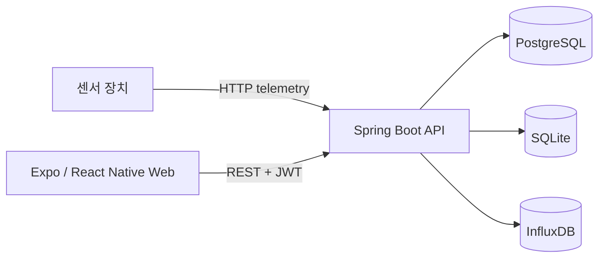

# TerraByte

도심 유휴 공간이 스마트팜에 적합한지 설치 전에 진단하고, 설치 후에는 센서 데이터를 지속적으로 모니터링하는 통합 서비스입니다. 온도, 습도, 광량(PPFD), 토양 수분 등의 측정값을 작물별 권장 범위와 비교해 적합도와 개선 방향을 제공합니다.

## 주요 기능

- 회원가입·로그인과 JWT 기반 사용자 인증
- 재배 공간, 장치, 화분 등록 및 조회
- 센서 텔레메트리 수집과 최신값·이력 조회
- 작물별 환경 적합도 계산과 항목별 점수 표시
- 토양 프로필 기반 추천 정보 제공
- Expo Web 대시보드와 Storybook 컴포넌트 카탈로그
- Swagger UI를 통한 API 명세 확인 및 호출

## 시스템 구성



- PostgreSQL: 사용자, 공간, 장치 등 업무 데이터
- SQLite: 작물별 환경 점수 프로필과 계산용 기준 데이터
- InfluxDB: 센서 시계열 데이터

## 기술 스택

| 영역 | 기술 | 현재 기준 |
| --- | --- | --- |
| Frontend | TypeScript, Expo, React Native, React Native Web | Expo 57, React 19, React Native 0.86 |
| Backend | Java, Spring Boot, Gradle | Java 소스 호환 17, 컨테이너 JDK 21, Spring Boot 3.5.16, Gradle 8.14.3 |
| Database | PostgreSQL, SQLite, InfluxDB | PostgreSQL 17, InfluxDB 2.7 |
| Edge | Orange Pi, Arduino/ESP 계열 센서 보드 | Python, C/C++ |
| Infra | Docker, Docker Compose, nginx | Compose v2, nginx 1.27 |

> 과거 README의 Next.js 14 표기는 현재 구현과 달랐습니다. 프론트엔드는 `frontend/app`의 Expo SDK 57 애플리케이션입니다.

## 디렉터리 구조

```text
.
├── backend/                  # Spring Boot API, DB 마이그레이션, 자동 테스트
├── frontend/
│   └── app/                 # Expo 앱, 화면·컴포넌트, Storybook
├── edge/
│   ├── arduino/             # 센서 보드 펌웨어
│   ├── fusion_scripts/      # 센서 데이터 처리 스크립트
│   └── pi/                  # Orange Pi 수집·전송 코드
├── docs/                    # 설계, 개발 환경, 프로젝트 문서
├── docker-compose.yml       # 개발 스택
├── docker-compose.prod.yml  # 프로덕션 유사 스택
├── .env.example             # 로컬 환경 변수 예시
└── Makefile                 # 자주 쓰는 Compose 명령 단축키
```

## Docker로 시작하기

Docker 방식은 호스트에 Java, Gradle, Node.js, PostgreSQL, InfluxDB를 별도로 설치하지 않아도 되어 권장합니다. Docker Compose v2와 Buildx가 필요합니다.

### 1. Docker 설치

#### Windows 10/11

1. [Docker Desktop for Windows 공식 설치 안내](https://docs.docker.com/desktop/setup/install/windows-install/)에서 설치 파일을 내려받아 실행합니다.
2. 설치 과정에서 WSL 2 기반 엔진을 사용합니다. WSL이 없다면 관리자 PowerShell에서 `wsl --install`을 실행하고 재부팅합니다.
3. Docker Desktop을 시작한 뒤 **Settings > General > Use WSL 2 based engine**이 활성화되어 있는지 확인합니다.
4. WSL 터미널에서 개발한다면 **Settings > Resources > WSL Integration**에서 사용할 배포판을 활성화합니다.

Windows에서는 Linux 컨테이너 모드를 사용해야 합니다. WSL을 사용할 경우 저장소를 `/mnt/c/...`보다 WSL 내부 파일 시스템(예: `~/git-hub/...`)에 두면 bind mount 성능이 더 좋습니다.

#### macOS

1. Mac 칩에 맞는 Docker Desktop을 [공식 설치 안내](https://docs.docker.com/desktop/setup/install/mac-install/)에서 내려받습니다.
2. `Docker.dmg`를 열고 Docker를 Applications로 옮긴 뒤 실행합니다.
3. 첫 실행 설정을 완료하고 메뉴 막대의 Docker 아이콘이 준비 상태인지 확인합니다.

Homebrew를 사용한다면 `brew install --cask docker` 후 Applications에서 Docker를 한 번 실행해도 됩니다.

#### Ubuntu Linux

배포판 저장소의 오래된 `docker.io` 대신 [Docker Engine 공식 Ubuntu 설치 절차](https://docs.docker.com/engine/install/ubuntu/)를 따르는 것을 권장합니다. Docker 공식 apt 저장소를 등록한 뒤 다음 패키지를 설치합니다.

```bash
sudo apt update
sudo apt install docker-ce docker-ce-cli containerd.io docker-buildx-plugin docker-compose-plugin
sudo systemctl enable --now docker
sudo docker run --rm hello-world
```

매번 `sudo`를 쓰지 않으려면 사용자를 `docker` 그룹에 추가한 뒤 로그아웃·로그인합니다. `docker` 그룹은 root 수준 권한을 줄 수 있으므로 공유 서버에서는 보안 정책을 먼저 확인하세요.

```bash
sudo usermod -aG docker "$USER"
```

### 2. 설치 확인

새 터미널에서 아래 명령이 모두 성공해야 합니다. `docker-compose`(하이픈)가 아니라 `docker compose`(공백) 형식의 Compose v2를 사용합니다.

```bash
docker --version
docker compose version
docker buildx version
docker run --rm hello-world
```

권장 자원은 CPU 4코어, 메모리 8GB 이상입니다. Docker Desktop에서 빌드가 반복해서 종료되면 **Settings > Resources**에서 할당량을 늘립니다.

### 3. 저장소 받기

```bash
git clone https://github.com/PNU-2026-AI-Hackathon/pnuai-b-02-terrabyte.git
cd pnuai-b-02-terrabyte
```

### 4. 한 줄로 개발 스택 실행

Make 사용 여부에 따라 다음 두 방식 중 하나를 선택합니다. 두 방식 모두 `.env`가 없을 때만 `.env.example`을 복사하며, PostgreSQL·InfluxDB·백엔드·프론트엔드를 백그라운드에서 한 번에 빌드하고 실행합니다.

#### 방식 A: Make 사용(권장)

macOS, Linux 또는 Make가 설치된 Windows 환경에서 사용합니다.

```bash
make up-d
```

`make up-d`는 내부적으로 `.env` 준비와 `docker compose up -d --build`를 차례로 실행합니다. 사용할 수 있는 전체 단축 명령은 `make help`로 확인합니다.

#### 방식 B: Docker Compose 직접 사용

Make를 설치하지 않아도 됩니다. 사용하는 셸에 맞는 한 줄 명령을 실행합니다.

macOS/Linux:

```bash
test -f .env || cp .env.example .env; docker compose up -d --build
```

Windows PowerShell:

```powershell
if (!(Test-Path .env)) { Copy-Item .env.example .env }; docker compose up -d --build
```

`.env.example`의 기본 계정과 비밀키는 로컬 개발 전용입니다. 일반적인 로컬 실행은 그대로 사용할 수 있지만 외부에 노출되는 환경에는 절대 사용하지 마세요. Linux에서는 bind mount 파일 권한을 맞추기 위해 `.env`의 값을 다음 결과로 변경할 수 있습니다.

```bash
id -u
id -g
# 위 결과를 각각 DOCKER_UID, DOCKER_GID에 입력
```

### 5. 실행 상태 확인

처음 실행할 때 이미지를 받고 Gradle/npm 의존성을 설치하므로 몇 분 걸릴 수 있습니다. 다음 명령으로 상태와 로그를 확인합니다.

```bash
make ps                                       # 또는 docker compose ps
make logs                                     # 또는 docker compose logs -f
```

포그라운드에서 로그를 보며 실행하려면 기존 스택을 내린 뒤 다음 명령 중 하나를 사용합니다.

```bash
make down && make up
# 또는
docker compose down && docker compose up --build
```

`Ctrl+C`를 누르면 포그라운드 실행이 중단됩니다. 백그라운드 실행에서 `docker compose logs -f`를 사용한 경우에는 로그 보기만 종료됩니다.

| 서비스 | 기본 주소/포트 | 확인 방법 |
| --- | --- | --- |
| 프론트엔드 (Expo Web) | http://localhost:8081 | 브라우저 접속 |
| 백엔드 API | http://localhost:8080 | `/actuator/health` |
| Swagger UI | http://localhost:8080/swagger-ui.html | 브라우저 접속 |
| PostgreSQL | `localhost:5432` | `docker compose exec postgres pg_isready -U terrabyte` |
| InfluxDB UI | http://localhost:8086 | `terrabyte` / `terrabyte-admin-password` |
| 백엔드 원격 디버그 | `localhost:5005` | IDE의 Remote JVM Debug 연결 |

모든 서비스가 준비됐는지 확인합니다.

```bash
docker compose ps
curl --fail http://localhost:8080/actuator/health
curl --fail http://localhost:8086/health
```

`backend`가 `healthy`가 될 때까지 첫 실행 기준 1~2분 이상 걸릴 수 있습니다. 문제가 있으면 서비스별 로그를 확인합니다.

```bash
docker compose logs --tail=200 backend
docker compose logs --tail=200 frontend
docker compose logs --tail=200 postgres influxdb
```

## 테스트 방법

### 백엔드 자동 테스트

외부 PostgreSQL/InfluxDB 없이 H2와 메모리 SQLite 구성을 사용해 전체 백엔드 테스트를 실행합니다. 개발 스택이 실행 중이어도 별도의 일회성 컨테이너에서 실행할 수 있습니다.

```bash
make test
```

`make`가 없는 환경에서는 Makefile과 동일하게 Gradle 캐시 경로를 분리해 실행합니다.

```bash
docker compose run --rm --no-deps \
  -e GRADLE_USER_HOME=/home/dev/.gradle/one-shot \
  backend --project-cache-dir /home/dev/.gradle/one-shot-project test
```

성공 기준은 마지막에 `BUILD SUCCESSFUL`이 출력되고 명령이 종료 코드 0으로 끝나는 것입니다.

### 프론트엔드 정적 검사와 Storybook 빌드

현재 프론트엔드에는 별도의 단위 테스트 스크립트가 없으므로 TypeScript 검사와 Storybook 정적 빌드를 기본 검증으로 사용합니다.

```bash
docker compose exec frontend npx tsc --noEmit
docker compose exec frontend npm run build-storybook
```

컴포넌트를 브라우저에서 확인하려면 Storybook 프로필을 실행합니다.

```bash
docker compose --profile storybook up -d storybook
docker compose logs -f storybook
# http://localhost:6006
```

### API 스모크 테스트

스택 실행 후 다음 요청으로 회원가입·로그인까지 빠르게 확인할 수 있습니다. 같은 이메일이 이미 존재하면 이메일 값을 바꾸거나 아래의 DB 초기화 절차를 사용합니다.

```bash
curl -i -X POST http://localhost:8080/api/auth/signup \
  -H 'Content-Type: application/json' \
  -d '{"email":"docker-test@terrabyte.local","password":"password1","nickname":"Docker Test"}'

curl -i -X POST http://localhost:8080/api/auth/login \
  -H 'Content-Type: application/json' \
  -d '{"email":"docker-test@terrabyte.local","password":"password1"}'
```

센서 데이터 전송을 포함한 통합 시나리오와 전체 JSON 예시는 [백엔드 가이드](backend/README.md)를 참고하세요. API 요청·응답 스키마는 실행 중인 [Swagger UI](http://localhost:8080/swagger-ui.html)에서 확인할 수 있습니다.

## 자주 쓰는 Docker Compose 명령

같은 작업을 Make 단축 명령이나 Docker Compose 원본 명령 중 원하는 방식으로 실행할 수 있습니다.

| 작업 | Make 사용 | Docker Compose 직접 사용 |
| --- | --- | --- |
| 환경 파일 준비 | `make init` | `test -f .env \|\| cp .env.example .env` |
| 포그라운드 실행 | `make up` | `docker compose up --build` |
| 백그라운드 실행 | `make up-d` | `docker compose up -d --build` |
| 상태 확인 | `make ps` | `docker compose ps` |
| 전체 로그 | `make logs` | `docker compose logs -f` |
| 백엔드 로그 | `make logs-backend` | `docker compose logs -f backend` |
| 백엔드 재시작 | `make restart` | `docker compose restart backend` |
| 이미지 빌드 | `make build` | `docker compose build` |
| 캐시 없이 재빌드 | `make rebuild` | `docker compose build --no-cache` |
| 백엔드 테스트 | `make test` | [백엔드 자동 테스트](#백엔드-자동-테스트)의 전체 명령 |
| 스택 중지 | `make down` | `docker compose down` |
| 중지 및 DB 초기화 | `make down-v` | `docker compose down -v` |

컨테이너 셸이나 DB 콘솔에 직접 들어갈 때는 다음 명령을 사용합니다.

```bash
docker compose exec backend bash               # 백엔드 컨테이너 셸
docker compose exec frontend bash              # 프론트엔드 컨테이너 셸
docker compose exec postgres psql -U terrabyte -d terrabyte
```

`docker compose down -v`는 PostgreSQL과 InfluxDB 데이터를 삭제하므로 초기화가 필요할 때만 실행하세요.

## 프로덕션 유사 스택

개발 스택과 달리 소스를 mount하지 않고, 백엔드 jar와 Expo Web 정적 번들을 이미지에 빌드합니다. `.env`의 `POSTGRES_PASSWORD`, `INFLUX_PASSWORD`, `INFLUX_TOKEN`, `TELEMETRY_DEVICE_KEY`, `JWT_SECRET`을 안전한 값으로 반드시 교체한 뒤 실행합니다.

```bash
docker compose -f docker-compose.prod.yml config
docker compose -f docker-compose.prod.yml up -d --build
docker compose -f docker-compose.prod.yml ps
curl --fail http://localhost:8088/actuator/health
# 웹: http://localhost:8088
```

중지할 때는 다음 명령을 사용합니다. 데이터까지 삭제하려는 경우에만 끝에 `-v`를 추가합니다.

```bash
docker compose -f docker-compose.prod.yml down
```

프로덕션 유사 스택은 로컬 검증용 기본 구성입니다. 실제 공개 배포에서는 TLS, 방화벽, 비밀 관리, 백업, 관측성 설정을 별도로 적용해야 합니다.

## 문제 해결

| 증상 | 확인 및 해결 |
| --- | --- |
| Docker daemon 연결 오류 | Docker Desktop/Engine이 실행 중인지 확인하고 `docker info` 실행 |
| `docker compose` 명령이 없음 | Compose v2 플러그인 설치. [공식 Compose 설치 안내](https://docs.docker.com/compose/install/) 참고 |
| `port is already allocated` | `.env`의 `BACKEND_PORT`, `FRONTEND_PORT`, `POSTGRES_PORT`, `INFLUX_PORT` 등을 미사용 포트로 변경 |
| 백엔드가 DB/Flyway 오류로 종료 | 로그 확인 후 로컬 데이터 삭제가 가능하면 `docker compose down -v`로 초기화 |
| 프론트엔드 모듈 오류 | `docker compose restart frontend`; 계속되면 `docker compose build --no-cache frontend` |
| 수정한 코드가 반영되지 않음 | 백엔드는 `docker compose restart backend`, 프론트는 `docker compose restart frontend` |
| Linux에서 생성 파일이 root 소유 | `.env`의 `DOCKER_UID`/`DOCKER_GID`를 `id -u`/`id -g`에 맞추고 이미지 재빌드 |
| 빌드 중 메모리 부족/강제 종료 | Docker에 할당한 메모리를 8GB 이상으로 늘리고 다시 빌드 |

더 자세한 버전 고정, 원격 디버깅, DB 접속, 모바일 기기 연결 방법은 [Docker 개발·배포 환경 가이드](docs/docker_dev_environment.md)에 있습니다.

## Docker 없이 실행

호스트에서 직접 실행하려면 JDK 17 이상, Node.js/npm, PostgreSQL, InfluxDB 2.x가 필요합니다. 백엔드는 [backend/README.md](backend/README.md), Expo 앱과 iOS/Android 실행은 [frontend/README.md](frontend/README.md)를 참고하세요.

## 팀

| LEADER | MEMBER1 | MEMBER2 | MEMBER3 | MEMBER4 |
|:---:|:---:|:---:|:---:|:---:|
| [김동현](https://github.com/cnvxlns) | [김민서](https://github.com/oesmln) | [김효빈](https://github.com/iris11132-max) | [문성현](https://github.com/7hyunii) | [박태훈](https://github.com/Reighnex) |
| HW 설계 | 백엔드 및 DevOps | 기획·도메인 분석 | 풀스택 개발 | 공간 진단 알고리즘 설계 |
