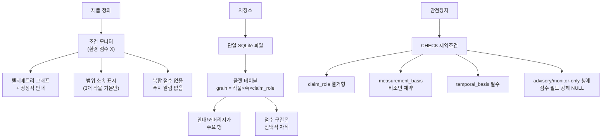

# 🌱 AI 에이전트 위원회 토론 요약

> **프로젝트**: pnuai-b-02-terrabyte  
> **토론 주제**: 작물 생육환경 데이터 정제 및 SQLite 스키마 설계  
> **토론 일시**: 2026-07-15  
> **진행자**: claude-fable-5 (moderator)

---

## 📋 목차

1. [토론 배경](#1-토론-배경)
2. [참여 에이전트](#2-참여-에이전트)
3. [핵심 문제: 센서와 근거의 불일치](#3-핵심-문제-센서와-근거의-불일치)
4. [검증 결과: 64셀 매트릭스 분석](#4-검증-결과-64셀-매트릭스-분석)
5. [제안된 8가지 옵션](#5-제안된-8가지-옵션)
6. [비평 라운드 결과](#6-비평-라운드-결과)
7. [최종 결정](#7-최종-결정)
8. [새로 발견된 위험 요소](#8-새로-발견된-위험-요소)
9. [미결 사항](#9-미결-사항)

---

## 1. 토론 배경

### 문제 정의

한국어로 작성된 8개 작물 생육환경 연구 문서(마크다운)와 1개 근거 격차 레지스트리를 **SQLite 데이터베이스**로 정제하여, 하드웨어 센서 텔레메트리 기반 **환경 점수 대시보드**를 구현하기 위한 스키마를 설계하는 것이 목표였다.

### 범위

| 포함 | 제외 |
|------|------|
| 데이터 정제 | 점수 산출 알고리즘 |
| 스키마 설계 | 대시보드 API/UI |
| 센서-근거 매핑 분석 | 하드웨어 펌웨어 |
| | ML 모델 |

### 원본 데이터

| 작물 | 파일 | 라인 수 | 비고 |
|------|------|---------|------|
| 바질 | `basil_growth_environment.md` | 1009 | 가장 심층 연구됨 |
| 페퍼민트 | `peppermint_growth_environment.md` | 570 | 심층 연구됨 |
| 방울토마토 | `cherry_tomato_growth_environment.md` | 254 | 동일 골격 |
| 대파 | `welsh_onion_growth_environment.md` | 254 | 동일 골격 |
| 루꼴라 | `arugula_growth_environment.md` | 254 | 동일 골격 |
| 와사비 | `wasabi_growth_environment.md` | 254 | 동일 골격 |
| 상추 | `lettuce_growth_environment.md` | 254 | 동일 골격 |
| 고수 | `coriander_growth_environment.md` | 254 | 동일 골격 |

> [!IMPORTANT]
> 8개 문서 모두 동일한 10개 섹션 골격을 공유하지만, **바질과 페퍼민트는 근거 격차 레지스트리에 누락**되어 있다. 또한 6개 254줄 문서는 테이블 레이아웃까지 동일하나, 바질/페퍼민트는 구조가 상이하여 결정적 파싱이 불안전하다.

### 핵심 연구 원칙

문서가 고수하는 원칙들:

- 해당 작물에 직접 적용된 자료만 수치 근거로 사용
- 실험에서 **사용된 조건**과 **검증된 최적치**를 구별
- 직접 확인되지 않은 것은 추측하지 않고 **"직접 근거 없음"**으로 기록
- PPFD에서 DLI를 유도하지 않음, 정성적 설명을 서수 등급으로 변환하지 않음
- 최적 범위 밖의 값을 사망/위험 임계치로 재해석하지 않음

---

## 2. 참여 에이전트

### 라운드 1: 제안 (10명)

| 에이전트 ID | 엔진 | 모델 | 담당 질문 |
|------------|------|------|-----------|
| codex-schema-architect | Codex | gpt-5.6-sol | Q1, Q3, Q5: SQLite 관계형 구조, 값 타이핑, 단위 |
| codex-extraction-engineer | Codex | gpt-5.6-sol | Q6, Q7: 마크다운→DB 파이프라인, 레지스트리 통합 |
| codex-evidence-modeler | Codex | gpt-5.6-sol | Q2, Q4: 부재 모델링, 적용 범위 |
| codex-sensor-integrator | Codex | gpt-5.6-sol | Q8, Q10: 센서 채널 점수화 가능성, 교정 |
| codex-critic | Codex | gpt-5.6-sol | 실패 모드 분석, 최소 가드레일 |
| agy-explorer | AGY | Claude Opus 4.6 | Q1 역방향: 비관습적 설계 탐색 |
| agy-domain-skeptic | AGY | Claude Opus 4.6 | 원예학적 타당성 검증 |
| agy-product-advocate | AGY | Claude Opus 4.6 | 대시보드 사용자 관점 |
| agy-skeptic | AGY | Claude Opus 4.6 | YAGNI 적용, 최소 스키마 주장 |
| agy-data-steward | AGY | Claude Opus 4.6 | 버전 관리, 출처, 재현성 |

> [!NOTE]
> 두 AGY 에이전트가 할당량 초과로 차단되어 02:48에서 07:24까지 지연되었으나, 과잉설계 방지 역할을 담당하고 있어 의도적으로 대기하였다. 이 판단은 최종 합성에서 입증되었다.

### 라운드 2: 비평 (5명)

| 비평가 | 관점 |
|--------|------|
| critic-fidelity | 근거 충실도 |
| critic-buildability | 구현 가능성 |
| critic-consumer | 소비자/사용자 |
| critic-product | 제품 관점 |
| critic-simplicity | 단순성 |

---

## 3. 핵심 문제: 센서와 근거의 불일치

토론의 핵심 긴장은 **센서 셋과 근거 기반이 거의 겹치지 않는다**는 것이다.

| 센서 | 상태 | 설명 |
|------|------|------|
| 🌡️ 기온 | **가장 강한 일치** | 바질 25-30°C 등 직접 비교 가능. 단, 허용 시간 데이터 없음 |
| 💧 습도 | ⚠️ 부분적/위험 | RH 수치는 모두 **질병 위험** 임계치(85%, 95%), 생육 최적치가 아님 |
| 💡 조도 (lux) | ❌ 단위 불일치 | 문서의 모든 광 데이터는 PPFD/DLI. lux→PPFD 변환은 근거 없음 |
| 🌱 토양수분 | ❌ 측정기준 불일치 | 포장용수량 비율, 특정 센서/배지 기반 VWC. 범용 센서와 무관 |
| 🌡️ 토양온도 | ⚠️ 단계별만 | 발아기 근거만 존재, 전주기 최적치 없음 |
| 🏭 CO₂ | ❌ 거의 무근거 | 바질의 CO₂×온도 상호작용 연구 1건뿐 |
| 🌫️ 미세먼지 | ❌ 무근거 | 원예 임계치 없음 |
| 🔊 소음 | ❌ 작물 생육 요인이 아님 | 점수화하면 유사과학 |

---

## 4. 검증 결과: 64셀 매트릭스 분석

진행자가 **8개 센서 × 8개 작물 = 64셀** 매트릭스를 직접 검증하였다.

### 코퍼스 전체 발견

```
"직접 근거 없음" 명시적 마커: 총 674개
```

| 작물 | 부재 마커 수 |
|------|-------------|
| 대파 | 97 |
| 루꼴라 | 94 |
| 페퍼민트 | 90 |
| 고수 | 87 |
| 바질 | 81 |
| 상추 | 80 |
| 방울토마토 | 75 |
| 와사비 | 70 |

> [!CAUTION]
> **부재는 이 데이터의 지배적 사실 유형이다.** 부재를 NULL이나 누락 행으로 모델링하는 것은 지배적 사실 유형을 예외로 모델링하는 것이다.

### 축별 결과

| 축 | 최적치 보유 작물 수 | 판정 |
|----|-------------------|------|
| 습도 | **0/8** | 점수화 불가 (만장일치) |
| 토양수분 | **0/8** | 배포별 교정 없이 점수화 불가 |
| 토양온도 | **0/8** (전주기) | 발아기만 지원 |
| 조도 | **0/8** | 단위 불일치가 절대적 |
| **기온** | **5/8** (값 보유) | **유일하게 부분적으로 점수화 가능** |

### 기온 상세

| 작물 | 값 | 즉시 사용 가능 | 주의사항 |
|------|-----|:-----------:|---------|
| 바질 | 25-30°C | ✅ | 주/야 분리 아님, 경보선 아님 |
| 페퍼민트 | 21-26°C | ✅ | - |
| 와사비 | 12.2-15°C | ✅ | 2개 출처의 겹치는 범위 |
| 상추 | 18-24°C | ⚠️ | `general_crop_reference`로 격하됨 |
| 대파 | 13-25°C | ❌ | **일평균** 수치 — 순간 센서 값과 비교는 범주 오류 |
| 방울토마토 | 없음 | ❌ | 작물 고유 값 없음 |
| 루꼴라 | 없음 | ❌ | 직접 근거 없음 |
| 고수 | 없음 | ❌ | 직접 근거 없음 |

> [!WARNING]
> **방울토마토, 루꼴라, 고수는 점수화 가능한 축이 0개이다.** 이 3개 작물에 대해 8개 센서 채널 중 어느 것으로도 환경 점수를 산출할 수 없다. 이는 스키마 문제가 아닌 **제품 정의 문제**이다.

**최종 수치**: 64셀 중 **확실히 3셀**, 주의사항 포함 시 4-5셀 → **약 94% 비어 있음**

---

## 5. 제안된 8가지 옵션

### 저장 구조 옵션 (상호 배타적)

````carousel
### Option A: 정규화된 장형 클레임 스키마
- **아이디어**: 행 하나당 원자적 주장 1개. 의미론적 역할(생육 목표/실험 조건/질병 위험/손상 임계치), 적용 범위, 출처를 구조화
- **장점**: 단위/측정기준 혼동이 구조적으로 어려워짐
- **단점**: 행/조인이 많고, 해커톤에서 구축 시간 부족 우려
- **비용**: 높음
<!-- slide -->
### Option B: JSON1 반구조화 (마크다운 정본)
- **아이디어**: 마크다운을 정본(canonical truth)으로 유지, SQLite를 재빌드 가능한 캐시로 사용. JSON1 확장으로 반구조화 저장
- **장점**: 주의사항("25-30°C, 주/야 분리 아님")을 하나의 불가분 사실로 보존
- **단점**: JSON 페이로드는 정적 검사 불가, 오타가 쿼리 시까지 안 보임
- **비용**: 중간
<!-- slide -->
### Option C: 검토된 JSONL 파이프라인
- **아이디어**: 검토/버전관리된 JSONL을 운영 진리원(SoT)으로, SQLite는 불변 릴리스 아티팩트
- **장점**: 사람 승인 없이는 파서 추측이나 모델 환각이 근거가 될 수 없음
- **단점**: 사람 검토가 병목, 해시 게이트 우회 시 드리프트 발생
- **비용**: 높음
<!-- slide -->
### Option D: 급진적 미니멀리즘 (플랫 테이블)
- **아이디어**: 수작업 JSON 2개를 정본으로, 단일 플랫 SQLite 테이블에 작물×축당 1행 (~64행)
- **장점**: 하루 만에 출하 가능. 94% NULL인 테이블을 정규화해봐야 의미 없음
- **단점**: 바질 기온에 최적치 + 손상 임계치가 동시 존재 → 1행으로 불가능
- **비용**: 낮음
````

### 횡단 옵션 (A-D와 조합 가능)

````carousel
### Option E: 파생 컨텍스트별 자격
- **아이디어**: 채널별 고정 플래그 대신, 작물/배포 컨텍스트/용도별로 SCORABLE/ADVISORY_ONLY/RECORD_ONLY를 동적 파생
- **장점**: 같은 채널이 맥락에 따라 다른 자격 → 유연함
- **비용**: 중간
<!-- slide -->
### Option F: 3계층 표현
- **아이디어**: 모든 작물×축 셀에 (1) 점수 밴드 (2) 커버리지 상태 (3) 정성적 조치(섹션9)를 병렬 제공
- **장점**: "알 수 없음" 대시보드 실패를 방지 — 항상 무언가를 표시
- **비용**: 중간
<!-- slide -->
### Option G: 2파일 + 불변 개정 리플레이
- **아이디어**: 텔레메트리와 지식을 2개 SQLite 파일로 분리, 불변 추가 전용 개정 테이블
- **장점**: 쓰기 경합/보존 정책 분리
- **단점**: LLM 추출이 결정적이지 않으면 개정 체인이 허구
- **비용**: 중간 | **만장일치 거부됨**
<!-- slide -->
### Option H: 제품 재정의 — 조건 모니터
- **아이디어**: 환경 점수 제품이 아님을 인정. 현재 수치 표시 + 문헌 임계치 존재 시 플래그 + 나머지는 정성적 안내
- **장점**: 측정된 근거 기반에 정직하게 부합하는 **유일한** 옵션
- **비용**: 낮음
````

---

## 6. 비평 라운드 결과

### 투표 집계

| 옵션 | Proceed | Revise | Reject |
|------|:-------:|:------:|:------:|
| **H** (제품 재정의) | **4** | 1 | 0 |
| F (3계층 표현) | 1 | 4 | 0 |
| A (정규화 클레임) | 1 | 2 | 2 |
| B (JSON1) | 0 | 4 | 1 |
| D (플랫 테이블) | 0 | 4 | 1 |
| E (컨텍스트 자격) | 0 | 4 | 1 |
| C (JSONL 파이프라인) | 0 | 2 | 3 |
| **G** (2파일 리플레이) | 0 | 0 | **5** |

### 비평가별 순위 (1위→8위)

| 순위 | critic-fidelity | critic-buildability | critic-consumer | critic-product | critic-simplicity |
|:----:|:-:|:-:|:-:|:-:|:-:|
| 1 | A | **H** | **H** | **H** | D |
| 2 | E | D | F | D | **H** |
| 3 | **H** | F | D | F | B |
| 4 | F | E | C | B | F |
| 5 | C | B | A | E | E |

> **Option H는 5명 중 3명이 1위, 나머지 2명도 2-3위로 평가** → 가장 강한 합의

### 결정의 핵심 (The Decision Crux)

유일한 반대자(critic-fidelity)가 스스로 조건을 제시했다:

> *"MVP가 3개 깨끗한 즉시 온도 범위 이상의 의미론적 수치 판단을 출력할 것인가? 그렇다면 Option A+E가 최소한의 안전 구조이고, 아니라면 Option H가 지배한다."*

진행자의 검증이 이를 **경험적으로** 답했다: 3개를 초과하는 수치 판단은 존재하지 않는다. 따라서 반대자 자신의 논리에 의해 **Option H가 지배**한다.

> [!TIP]
> 이 반대는 다수결로 기각된 것이 아니라, **측정에 의해 해소**되었다. 모든 비평가가 결국 같은 결론에 도달했다.

---

## 7. 최종 결정

### 채택 설계 요약



### 순위별 결정 상세

| 순위 | 옵션 | 판정 | 핵심 이유 |
|:----:|------|------|-----------|
| 1 | **Option H** | ✅ **채택** | 측정된 근거에 부합하는 유일한 옵션 |
| 2 | **Option D (수정)** | ✅ **수정 후 채택** | grain을 `작물×축`에서 `작물×축×claim_role`로 변경 |
| 3 | **Option F (반전)** | ✅ **데이터 모델 채택, UI 계층 반전** | 안내 카드가 주요, 점수 밴드가 보조 |
| 4 | Option A | ⚠️ 구조 거부, 규율 유지 | CHECK 제약조건으로 안전 목표 이전 |
| 5 | Options B, C, E | ⏸️ 보류 | 해커톤 이후 프로젝트 생존 시 재검토 |
| 6 | **Option G** | ❌ **만장일치 거부** | LLM 추출이 결정적이지 않아 출처 주장이 허구 |

### 합성에서 나온 가장 중요한 통찰

> **"주요 엔티티를 반전시켜라."**

라운드 1에서는 제안되지 않고 라운드 2 비평에서 등장한 아이디어:

> *안내 조치(섹션 9 산문 + 커버리지 상태)를 1급 행으로 모델링하고, 점수화된 구간은 존재할 때만 선택적 자식으로 붙여라.*

**왜 중요한가**: 모든 라운드 1 제안(미니멀리스트 포함)은 DB의 역할이 "숫자 저장 + 빠진 숫자 설명"이라 가정했다. 그러나 실측 결과, 674개 명시적 부재와 대량의 정성적 안내가 페이로드이며, ~5개 사용 가능 숫자는 예외이다. 이 반전으로:

- 테이블이 94% 비어있는 것이 아니라 **~100% 차 있게** 됨 (실제 중요한 것으로)
- 희소성 진영과 안전성 진영의 겉보기 충돌이 해소됨

### 추출 파이프라인

- **6개 254줄 문서**: 결정적 파싱 안전
- **바질/페퍼민트**: 구조 상이하여 결정적 파싱 불안전 → 수작업 JSON 큐레이션
- **정본(SoT)**: 작물별 수작업 큐레이트 JSON → 간단한 스크립트로 SQLite 적재
- **레지스트리**: 6개→8개 작물로 확장 후, 별도 아티팩트로서 폐기 → 커버리지가 균일한 작물별 데이터로 통합

---

## 8. 새로 발견된 위험 요소

| 위험 | 설명 | 해결 |
|------|------|------|
| ⏰ **시간적 기준 혼동** | 대파의 13-25°C는 **일평균**. 순간 센서와 비교는 범주 오류. 어떤 라운드 1 에이전트도 발견 못함 | `temporal_basis` 필수 열거형 (instantaneous/daily_mean/cumulative/duration_window) |
| 👻 **부재의 투명화** | 부재를 "행 없음"으로 표현하면 점수화 금지 이유가 소실됨 | 부재도 `claim_role` 값으로, 필수 `reason` 포함 (레지스트리 10개 어휘) |
| 🌐 **번역 작업 미예산** | 섹션 9 안내문이 한국어 전문가용. 번역 없으면 안내 계층이 비거나 읽을 수 없음. 안내가 **주요 엔티티**가 된 이상 이것이 **임계 경로** | 사용자 에스컬레이션 필요 |
| 🏛️ **정직한 재정의의 정치적 실패** | 이해관계자가 "환경 점수 제품이 아니다"를 듣고 임의 임계치로 오버라이드할 위험 — 코퍼스가 방지하려던 바로 그 실패 | 스키마로 해결 불가. 이해관계자 결정 필요 |

---

## 9. 미결 사항

### 🔑 위원회가 해결하지 못한 질문

> **"코퍼스가 유일한 정당한 근거 기반인가?"**

- **포함 시**: 잘 알려진 일반 원예 참고치(RH 60-80% 등)를 `general_crop_reference`로 명시 표시하여 도입 → 습도/광 축이 8개 작물 모두에서 복원되어 **점수 제품 살아남**
- **배제 시**: 코퍼스의 엄격한 규율 유지 → **조건 모니터로 전환**
- **중요**: 스키마는 어느 쪽이든 동일하므로, 이 결정이 스키마 작업을 차단하지는 않음
- **판단 주체**: 프로젝트 오너(사용자)

### 기타 미지 사항

- 센서 제조사/모델, 정확도, 교정 상태 미지정
- 텔레메트리 샘플링 간격, 페이로드 스키마, 보존 정책 미정의
- 단일 배포에서 하나 vs 여러 작물 동시 재배 여부
- 대상 환경: 실내 화분 / 온실 / 수경 — 문서 근거가 이에 크게 의존
- 대상 사용자: 취미 재배자 vs 연구자
- 과거 텔레메트리를 같은 SQLite에 저장할지 여부

---

> [!NOTE]
> **전체 토론 자료 참조**
> - [00_brief.json](file:///C:/Git-hub/pnuai-b-02-terrabyte/backend/docs/debate/00_brief.json) — 토론 브리프
> - [01_moderator_validation.json](file:///C:/Git-hub/pnuai-b-02-terrabyte/backend/docs/debate/01_moderator_validation.json) — 진행자 검증 기록
> - [02_synthesis.json](file:///C:/Git-hub/pnuai-b-02-terrabyte/backend/docs/debate/02_synthesis.json) — 최종 합성
> - [cards/options.json](file:///C:/Git-hub/pnuai-b-02-terrabyte/backend/docs/debate/cards/options.json) — 익명화된 옵션 카드
> - [raw/](file:///C:/Git-hub/pnuai-b-02-terrabyte/backend/docs/debate/raw) — 원본 제안 10건
> - [cards/](file:///C:/Git-hub/pnuai-b-02-terrabyte/backend/docs/debate/cards) — 비평 카드 5건
