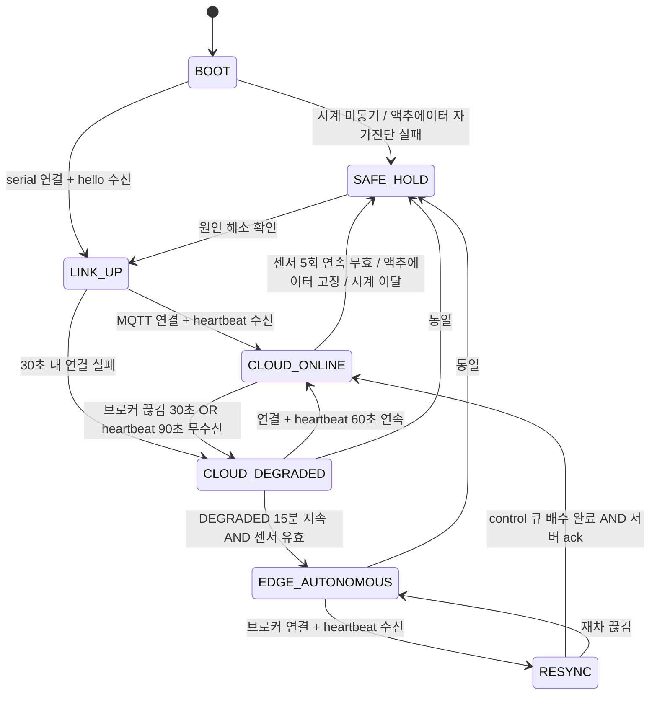
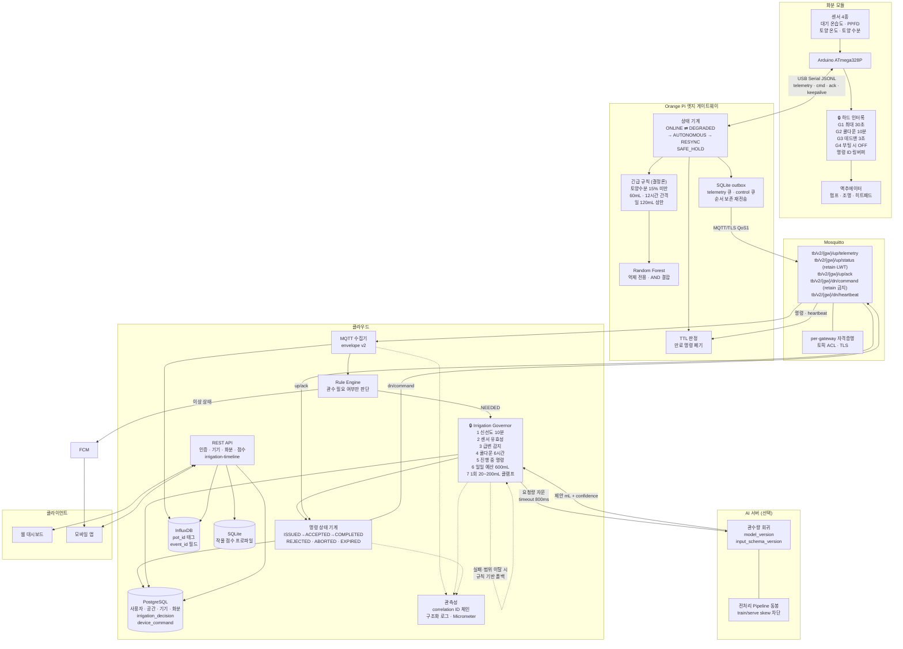

# 엣지 AI 제어 시스템 보강 설계

작성일: 2026-08-04 (Asia/Seoul)
대상: `ff4d306` + `feature/device-hierarchy` 기준 코드
전제: [`device_model_and_telemetry_contract.md`](device_model_and_telemetry_contract.md)의 4계층 모델과 MQTT 계약 v2를 **그대로 유지**하고 그 위에 안전·복원력 계층만 얹는다.

---

## 0. 가정과 확인 질문

### 0.1 이 문서가 전제한 가정

| # | 가정 | 틀렸을 때 영향 |
|---|---|---|
| A1 | 데모 구성은 Orange Pi 1대 + Arduino 1대 + 화분 1~2개. 다중 화분은 스키마만 지원 | 다중 노드 동시 관수 경합 제어가 추가로 필요 |
| A2 | 유량계가 없다. 관수량은 `mL = flow_ml_per_s × runtime_ms`로 **추정**한다 | 실제 관수량 검증 불가 — 상한을 더 보수적으로 잡아야 함 |
| A3 | Orange Pi는 NTP 동기화된다. **Arduino에는 RTC가 없다** | TTL·쿨다운 판정 주체가 바뀜 (§5.1 참조) |
| A4 | 클라우드는 단일 VM. HA 없음. 수분~수시간 다운타임 허용 | 다운타임이 일 단위면 엣지 자율 예산을 재설계해야 함 |
| A5 | 가정용 Wi-Fi. 장시간 오프라인은 예외 상황이지 상시 조건이 아니다 | 상시 오프라인이면 엣지가 주 판단자가 되어야 함 |
| A6 | 히트패드·조명은 관수보다 위험도가 낮다. 이 문서는 **관수 안전**에 집중한다 | 히트패드 화재 위험은 별도 열 차단 설계 필요 |

### 0.2 확인 질문 (답변 없이 위 가정으로 진행)

1. 펌프 정격 유량(mL/s)과 화분 배지 용적은? — 1회 관수 상한과 일일 예산 산정에 직접 들어간다.
2. 물탱크 수위 센서가 있는가? 없다면 빈 탱크 공회전(펌프 소손)을 감지할 방법이 없다.
3. 데모에서 실제로 물을 흘리는가, 아니면 펌프 구동만 보여주는가? — P1-9 E2E 범위가 달라진다.
4. 클라우드 인스턴스 사양과 대수는? — MQTT 브로커와 Spring을 같은 VM에 둘지 결정된다.
5. 히트패드 정격 전력과 하드웨어 과열 차단(서모스탯) 유무는?

---

## 1. 현재 구조의 치명적 취약점

코드에 실제로 존재하는 것만 다룬다. 각 항목은 파일·클래스로 특정한다.

### V1. 🔴 펌프를 물리적으로 멈출 주체가 없다

`edge/arduino`에는 액추에이터 코드가 **한 줄도 없고**, `TelemetryConfig.h`에 안전 상수도 없다.
계획상 명령은 Spring → MQTT → Orange Pi → serial → Arduino로 내려간다. 이 사슬에서
**펌프를 실제로 끄는 주체가 소프트웨어 4단계 위에 있다.**

> **장애 시나리오 F1 — 관수 중 Orange Pi 프리즈**
> 1. Spring이 `pump on, 30s` 명령 발행
> 2. Arduino가 펌프 GPIO를 HIGH로 올림
> 3. 3초 뒤 Orange Pi가 커널 패닉 / SD카드 I/O 행 / 전원 순단
> 4. `pump off` 명령이 영원히 오지 않음
> 5. **펌프가 무한 구동. 물탱크가 빌 때까지 계속 물을 붓는다.**
>
> 발생 확률: Orange Pi + SD카드 조합에서 결코 낮지 않다. 결과: 식물 침수 + 펌프 소손 + 물 넘침.

### V2. 🔴 명령 중복·지연 실행을 막는 장치가 전무하다

MQTT QoS 1은 **at-least-once**다. 중복 전달이 프로토콜상 정상 동작이다.

> **장애 시나리오 F2 — PUBACK 유실로 인한 이중 관수**
> 1. Spring이 `dose 150mL` 발행, 브로커가 Orange Pi에 전달
> 2. Orange Pi가 실행하고 PUBACK 전송 → 네트워크에서 유실
> 3. 브로커가 재전송 → **150mL 추가 관수**
> 4. `command_id`도 TTL도 없으므로 어느 쪽도 중복을 인지하지 못한다

> **장애 시나리오 F3 — 오프라인 중 쌓인 명령의 지연 폭탄**
> 1. Orange Pi가 2시간 오프라인
> 2. 그동안 Spring 룰 엔진이 20분마다 관수 명령 발행 → 브로커에 6건 큐잉
> 3. 재접속 순간 **6건이 한꺼번에 내려와 900mL를 연속 주입**
>
> 이건 가설이 아니라 QoS 1 + persistent session의 기본 동작이다.

### V3. 🔴 판단 입력의 신선도 하한이 없다

`InfluxMeasurementStore.findLatest`는 `range(start: 1970-01-01T00:00:00Z)`다.
아무리 오래된 값이라도 "최신값"으로 반환한다. `MeasurementService.validateObservedAt`은
**미래 5분만 막고 과거는 무제한 허용**한다.

> **장애 시나리오 F4 — 일주일 전 데이터로 관수**
> 1. Arduino 케이블이 빠져 7일간 측정 중단
> 2. 마지막 측정값은 토양수분 18% (건조)
> 3. 룰 엔진이 `findLatest`로 그 값을 읽고 "관수 필요" 판정
> 4. 그동안 사용자가 손으로 물을 줬는데도 **추가 관수 발생**

### V4. 🔴 outbox가 단일 FIFO라 head-of-line blocking이 발생한다

`outbox.py`는 `ORDER BY created_at_epoch, event_id`로 한 건씩 꺼내고,
`service.py._upload_once`는 실패 시 `break`로 뒤 항목을 막는다. 순서 보존이 의도지만
**제어 평면 메시지까지 같은 큐를 쓰면 텔레메트리 한 건이 관수 결과 보고를 막는다.**

또한 MQTT 전환 후에는 HTTP status code가 사라져 `mark_dead`를 호출할 판정 근거가 없어진다.
현재 `dead` 격리는 4xx 응답에 의존한다. **MQTT에는 4xx가 없다.**

> **장애 시나리오 F5 — 독 메시지가 관수 이력을 가둔다**
> 1. 엣지 자율 관수 3건 실행, 결과가 outbox에 적재
> 2. 그 앞에 브로커가 영구 거부하는 텔레메트리 1건이 존재 (payload 초과 등)
> 3. 지수 백오프로 무한 재시도, 뒤의 관수 이력 3건이 영영 서버에 도달하지 못함
> 4. **서버의 일일 관수 예산에 이 3건이 반영되지 않아 예산을 초과 승인한다**

### V5. 🟠 노드 자동 바인딩이 무제한이다

`MeasurementService.bindNode`는 미바인딩 화분이 없으면 화분을 **무조건 새로 만든다**.
상한이 없다. 게다가 `TelemetryConfig.h`의 `TB_NODE_ID` 기본값은 `UNCONFIGURED`다.

> **장애 시나리오 F6 — 노드 ID 플래핑으로 화분 폭증**
> Arduino 펌웨어를 재플래시하며 node_id가 바뀌거나, 미프로비저닝 보드 2대가 모두
> `UNCONFIGURED`로 붙으면 화분이 계속 생기거나 서로 다른 보드가 한 화분을 공유한다.
> 화분마다 독립적인 관수 예산을 갖기 때문에 **예산 우회 경로가 된다.**

### V6. 🟠 MQTT 연결 상태와 백엔드 생존이 동일시된다

설계상 Orange Pi는 브로커 연결로 "온라인"을 판단한다. 그런데 브로커와 Spring은 별개 프로세스다.

> **장애 시나리오 F7 — 브로커는 살아 있고 Spring만 죽음**
> 1. Spring이 OOM으로 죽음. Mosquitto는 정상
> 2. Orange Pi는 연결이 살아 있으니 `CLOUD_ONLINE`으로 판단
> 3. 텔레메트리를 계속 발행하지만 **아무도 구독하지 않는다** (QoS1 + persistent session이면 브로커가 쌓고, 아니면 소실)
> 4. 엣지 자율 모드로 전환되지 않아 **아무도 관수를 판단하지 않는다.** 식물이 마른다

### V7. 🟠 관수 판단의 입력이 현재 존재하지 않는다

토양수분 센서는 `TB_SOIL_MOISTURE_ENABLED=0`으로 **컴파일 타임에 꺼져 있고**,
적합도 점수는 T·H·L만 쓰므로 토양수분은 어디에도 반영되지 않는다.
즉 **관수 기능 전체가 지금은 입력이 0인 상태에서 설계되고 있다.**

### V8. 🟡 AI 응답을 검증 없이 신뢰하는 경로가 열려 있다

`todolist` P3-4는 "AI 호출 → 관수량 명령 발행"이다. 중간에 검증 단계가 없다.
회귀 모델이 학습 분포 밖 입력을 받으면 임의의 값을 낸다. 합성 데이터로 학습할 가능성이
높으므로(§8-2 미결정) **분포 밖 입력은 예외가 아니라 기본값이다.**

---

## 2. 개선 사항 5선 (우선순위 순)

선정 기준: *데모 실패 확률을 가장 크게 낮추는가*, *하드웨어 없이 지금 착수 가능한가*, *나중에 되돌리기 비싼가*.

---

## 개선 1. 관수 안전 게이트웨이 (Irrigation Safety Governor)

**우선순위 1위 이유:** 순수 백엔드 작업이라 하드웨어 없이 오늘 착수·단위 테스트 가능하고,
V2·V3·V8을 한 지점에서 동시에 막는다. 그리고 이 choke point가 없으면 뒤의 모든 개선이
"우회 가능한 권고"에 머문다.

### 해결하려는 문제
V2(중복 명령), V3(오래된 입력), V8(AI 오판), 수동 조작 남용.
현재는 명령을 만들 수 있는 경로가 룰 엔진·AI·수동 API 셋인데 공통 관문이 없다.

### 변경할 컴포넌트
`backend` — 신규 패키지 `com.terrabyte.backend.irrigation`. Postgres 2개 테이블 추가.
`MeasurementStore`에 신선도 제한 조회 1개 추가.

### 구체적인 변경 내용

**모든 관수 명령은 예외 없이 `IrrigationGovernor.authorize()`를 통과해야 한다.**
`DeviceCommandService`는 Governor가 발급한 `Grant` 객체 없이는 명령을 발행할 수 없도록
생성자 수준에서 강제한다 (Governor를 거치지 않는 공개 메서드를 만들지 않는다).

게이트는 **순서대로** 평가하고, 첫 거부에서 멈추며, 모든 판정을 기록한다.

| 순서 | 게이트 | 거부 코드 | 기본값 |
|---|---|---|---|
| 1 | 측정값 신선도 | `INPUT_STALE` | `now - observed_at > 10분` |
| 2 | 센서 유효성 | `SENSOR_INVALID` | `soil_sensor_valid=false` 또는 `soil_moisture_pct ∉ [0,100]` |
| 3 | 급변 감지 | `IMPLAUSIBLE_JUMP` | 60초 내 토양수분 30%p 이상 변동 |
| 4 | 쿨다운 | `COOLDOWN` | 마지막 **완료된** 관수로부터 6시간 |
| 5 | 진행 중 명령 | `IN_FLIGHT` | 같은 화분에 미만료·미종결 명령 존재 |
| 6 | 일일 예산 | `DAILY_BUDGET` | 24시간 누적 실제 관수량 > 600mL |
| 7 | 1회 상한 클램프 | (거부 아님) | `[20mL, 200mL]`로 클램프 |

**핵심 설계 원칙 3가지**

1. **일일 예산은 "명령 발행량"이 아니라 "실제 실행 보고량"으로 계산한다.**
   `device_command.actual_ml`이 채워진 것만 합산한다. 미종결 명령은 `granted_ml`로 보수적 가산.
   이렇게 해야 엣지 자율 관수분이 복구 후 동기화될 때 예산에 자동 반영된다(V4 대응).
2. **수동 조작은 쿨다운만 우회할 수 있고 1회 상한과 일일 예산은 우회할 수 없다.**
   우회 시 `override_reason`을 필수로 받아 감사 로그에 남긴다.
3. **AI는 게이트 1~6에 관여하지 않는다.** AI는 게이트 7 직전의 "요청량 제안"일 뿐이다.

### 스키마 예시

```sql
-- V11__create_irrigation_decision.sql
CREATE TABLE irrigation_decision (
    id BIGINT GENERATED BY DEFAULT AS IDENTITY PRIMARY KEY,
    pot_id BIGINT NOT NULL REFERENCES pot (id) ON DELETE CASCADE,
    correlation_id VARCHAR(64) NOT NULL,      -- 판단 근거가 된 텔레메트리 event_id
    source VARCHAR(20) NOT NULL,              -- RULE | RULE_AI | MANUAL | EDGE_FALLBACK
    sample_observed_at TIMESTAMPTZ NOT NULL,
    soil_moisture_pct DOUBLE PRECISION,
    rule_verdict VARCHAR(20) NOT NULL,        -- NEEDED | NOT_NEEDED
    ai_model_version VARCHAR(50),
    ai_requested_ml INTEGER,
    granted_ml INTEGER,                       -- 거부 시 NULL
    deny_reason VARCHAR(30),                  -- INPUT_STALE | COOLDOWN | ...
    clamp_reason VARCHAR(30),                 -- DAILY_BUDGET | MAX_DOSE | NULL
    command_id VARCHAR(40),                   -- 발행된 경우
    created_at TIMESTAMPTZ NOT NULL DEFAULT CURRENT_TIMESTAMP,
    CONSTRAINT ck_irrigation_decision_outcome
        CHECK ((granted_ml IS NOT NULL AND deny_reason IS NULL)
            OR (granted_ml IS NULL AND deny_reason IS NOT NULL))
);
CREATE INDEX ix_irrigation_decision_pot_time ON irrigation_decision (pot_id, created_at DESC);
```

```sql
-- V12__create_device_command.sql
CREATE TABLE device_command (
    command_id VARCHAR(40) PRIMARY KEY,       -- ULID (시간 정렬 가능)
    pot_id BIGINT NOT NULL REFERENCES pot (id) ON DELETE CASCADE,
    correlation_id VARCHAR(64) NOT NULL,
    actuator VARCHAR(20) NOT NULL,            -- pump | light | heater
    action VARCHAR(20) NOT NULL,              -- dose | on | off
    granted_ml INTEGER,
    max_runtime_ms INTEGER NOT NULL,
    state VARCHAR(20) NOT NULL,               -- ISSUED|ACCEPTED|COMPLETED|REJECTED|ABORTED|EXPIRED
    issued_at TIMESTAMPTZ NOT NULL,
    expires_at TIMESTAMPTZ NOT NULL,
    acked_at TIMESTAMPTZ,
    completed_at TIMESTAMPTZ,
    actual_ml INTEGER,                        -- 실행 보고값 — 예산 계산의 유일한 근거
    actual_runtime_ms INTEGER,
    stop_cause VARCHAR(30),                   -- VOLUME_REACHED|MAX_RUNTIME|WATCHDOG|ABORT|TANK_EMPTY
    origin VARCHAR(20) NOT NULL,              -- CLOUD | EDGE_FALLBACK
    CONSTRAINT ck_device_command_state CHECK (state IN
        ('ISSUED','ACCEPTED','COMPLETED','REJECTED','ABORTED','EXPIRED'))
);
CREATE INDEX ix_device_command_pot_state ON device_command (pot_id, state, issued_at DESC);
```

```java
public record IrrigationGrant(
        String commandId, long potId, int grantedMl, int maxRuntimeMs,
        Instant issuedAt, Instant expiresAt, String correlationId, CommandOrigin origin) {}

public sealed interface AuthorizationResult {
    record Granted(IrrigationGrant grant, String clampReason) implements AuthorizationResult {}
    record Denied(DenyReason reason, String detail) implements AuthorizationResult {}
}

// 유일한 진입점
AuthorizationResult authorize(long potId, int requestedMl, CommandSource source,
                              String correlationId, boolean cooldownOverride);
```

```yaml
# application.yml
app:
  irrigation:
    max-sample-age: PT10M
    min-interval: PT6H
    daily-budget-ml: 600
    dose-min-ml: 20
    dose-max-ml: 200
    default-flow-ml-per-s: 8.0      # A2 가정. 실측 후 교체
    command-ttl: PT2M
    implausible-jump-pct: 30
```

### 구현 난이도와 예상 효과
**난이도: 중하.** 순수 Java + JDBC. 하드웨어·MQTT 불필요. 1.5~2일.
**효과: 최대.** 과도 관수 시나리오 F2·F3·F4와 AI 오판(V8)이 이 한 지점에서 전부 차단된다.
데모 중 물이 넘칠 확률을 실질적으로 0으로 만든다.

### 부작용과 새 위험
- **과도 보수로 인한 "아무 일도 안 일어남".** 6시간 쿨다운이면 데모 중 두 번째 관수를 못 보여준다.
  → 데모 프로파일(`app.irrigation.min-interval: PT2M`)을 별도 프로필로 분리하고, **일일 예산과
  1회 상한은 데모에서도 낮추지 않는다.**
- `actual_ml` 기반 예산은 실행 보고가 유실되면 예산이 과소 집계된다.
  → 미종결 명령은 `granted_ml`로 가산(보수적)하고, TTL 만료 시 `EXPIRED`로 전이하되
  **예산에서 빼지 않는다** (실행됐을 수도 있으므로).
- 새 Postgres 쓰기 2건이 관수 경로에 추가된다. 규모상 무시 가능.

### 테스트 시나리오
1. 10분 넘은 샘플 → `INPUT_STALE`, 명령 미발행
2. `soil_sensor_valid=false` → `SENSOR_INVALID`
3. 5시간 59분 전 완료 관수 → `COOLDOWN`, 6시간 1분 전 → 승인
4. 같은 화분에 미만료 `ISSUED` 명령 존재 → `IN_FLIGHT`
5. 24시간 누적 550mL + 요청 200mL → 50mL로 클램프, `clamp_reason=DAILY_BUDGET`
6. 24시간 누적 600mL + 요청 → `DAILY_BUDGET` 거부
7. AI가 `99999` 반환 → 200mL 클램프
8. AI가 `-5` 반환 → 거부 (`AI_OUT_OF_RANGE`)
9. 수동 + `cooldownOverride=true` → 쿨다운만 통과, 일일 예산은 여전히 적용
10. 동시 요청 2건 → 하나만 승인 (`IN_FLIGHT` + 트랜잭션 격리)

### 완료 조건 / 실패 판정
- **완료:** 위 10개 테스트 통과. `DeviceCommandService`에 Governor를 우회하는 public 경로가
  없음을 코드 리뷰로 확인. 모든 판정이 `irrigation_decision`에 1행씩 남음.
- **실패 판정:** 어떤 입력 조합으로든 1회 200mL 또는 24시간 600mL를 초과하는 승인이 나오면 실패.

### 지금 / 나중
- **지금:** 게이트 1~7, 두 테이블, 설정 프로퍼티, 수동 API 연동
- **나중:** 작물별 예산 프로파일(현재는 전역 상수), 예산 회복 곡선(현재는 24h 롤링 합), 유량 실측 보정

---

## 개선 2. Arduino 펌웨어 하드 인터록

**우선순위 2위 이유:** V1(F1)은 소프트웨어로 절대 못 막는다. 상위 계층이 전부 죽어도
살아남는 유일한 방어선이며, 이것 없이는 실물 데모 자체가 위험하다.

### 해결하려는 문제
V1. Orange Pi·브로커·클라우드가 모두 죽어도 펌프가 스스로 멈춰야 한다.

### 변경할 컴포넌트
`edge/arduino` — `TelemetryConfig.h`, `src/main.cpp`, 신규 `ActuatorGuard.{h,cpp}`.

### 구체적인 변경 내용

**펌웨어에만 있는 4중 방어. 어떤 상위 명령으로도 완화할 수 없다.**

| # | 장치 | 구현 | 기본값 |
|---|---|---|---|
| G1 | 절대 최대 구동시간 | `millis()` 기반. 명령의 `ms`가 이보다 커도 무시 | `TB_PUMP_ABS_MAX_MS 30000` |
| G2 | 최소 재구동 간격 | 마지막 정지로부터. 위반 명령은 `rejected` | `TB_PUMP_MIN_INTERVAL_MS 600000` (10분) |
| G3 | 데드맨 워치독 | 펌프 구동 중 호스트로부터 `TB_HOST_TIMEOUT_MS` 동안 어떤 바이트도 없으면 즉시 정지 | `3000` |
| G4 | 부팅 안전 | `setup()` 최초 3줄에서 모든 액추에이터 핀 `OUTPUT` + `LOW`. serial 초기화보다 **먼저** | — |

추가로 **명령 ID 링버퍼 8개**를 유지해 같은 `id`를 두 번 실행하지 않는다(V2의 최종 방어선).

**TTL은 Arduino가 판정하지 않는다.** RTC가 없어 벽시계 비교가 불가능하다(A3).
TTL은 Orange Pi가 판정하고, Arduino는 `ms`(상대 시간)만 다룬다. 이 역할 분리가 중요하다.

### 메시지 스키마 예시

ATmega328P는 SRAM이 2KB다. serial 명령은 **짧은 키**를 쓴다.

```json
{"t":"cmd","id":"01J8F3","act":"pump","ms":18000,"ml":120}
```

```json
{"t":"ack","id":"01J8F3","ph":"accepted"}
{"t":"ack","id":"01J8F3","ph":"rejected","r":"cooldown"}
{"t":"ack","id":"01J8F3","ph":"completed","ms":17950,"stop":"volume_reached"}
{"t":"ack","id":"01J8F3","ph":"aborted","ms":3020,"stop":"watchdog"}
```

`telemetry`에 액추에이터 상태를 추가한다.

```json
{"message_type":"telemetry", ...,
 "actuators":{"pump":0,"light":1,"heater":0},
 "pump_lockout_ms":420000}
```

`pump_lockout_ms`는 남은 쿨다운이다. 서버가 엣지 상태를 그대로 관측할 수 있게 한다.

### 구현 난이도와 예상 효과
**난이도: 중.** 실물 회로가 필요하지만 로직 자체는 단순. 회로 2일 + 펌웨어 1.5일.
**효과: 최대(안전 측면).** F1을 구조적으로 제거한다. 상위 시스템 신뢰도와 무관해진다.

### 부작용과 새 위험
- G2(10분 쿨다운)가 서버 쿨다운(6시간)과 **이중 관리**된다. 값이 어긋나면 서버가 승인한 명령을
  Arduino가 거부해 사용자에게 원인 불명 실패로 보인다.
  → Arduino 쿨다운은 **항상 서버보다 짧게** 두고, 거부 사유 `cooldown`을 그대로 상위로 전파해
  `device_command.state=REJECTED`, `stop_cause=INTERLOCK_COOLDOWN`으로 기록한다.
- G3(데드맨)이 정상 상황에서 오작동하면 관수가 3초에 끊긴다.
  → Orange Pi가 펌프 구동 중 1초 주기 `{"t":"ka"}` 하트비트를 보낸다.
- 링버퍼 8개는 명령이 몰리면 오래된 id를 잊는다. 실사용 빈도(6시간 간격)상 충분.

### 테스트 시나리오
1. `ms: 60000` 명령 → 30초에 강제 정지, `stop:"max_runtime"`
2. 구동 중 USB 케이블 분리 → 3초 내 정지, `stop:"watchdog"` (재연결 후 확인)
3. 같은 `id` 2회 전송 → 두 번째는 `rejected`, `r:"duplicate"`
4. 정지 직후 재명령 → `rejected`, `r:"cooldown"`
5. 구동 중 Arduino 리셋 → 부팅 즉시 펌프 OFF (G4)
6. 하트비트 중단 시뮬레이션 → G3 발동

### 완료 조건 / 실패 판정
- **완료:** 6개 시나리오 실측 통과. 특히 2번과 5번을 **실제 물이 흐르는 상태에서** 확인.
- **실패 판정:** 어떤 조건에서든 펌프가 30초를 넘겨 구동되면 실패. 리셋 후 펌프가 켜진 채면 실패.

### 지금 / 나중
- **지금:** G1~G4, 링버퍼, ack 4종, `actuators` 필드
- **나중:** 수위 센서 연동(Q2), 유량계 피드백, 히트패드 열 차단(별도 설계)

---

## 개선 3. 명령 생애주기와 TTL — at-most-once 실행

**우선순위 3위 이유:** 개선 1(서버 판단)과 개선 2(물리 방어) 사이를 잇는 계층.
이게 없으면 Governor의 예산 계산이 실행 결과를 못 받아 무의미해진다(V4·F5와 직결).

### 해결하려는 문제
V2(F2 중복 전달), V2(F3 지연 폭탄), 그리고 예산 계산에 필요한 **실행 결과 회수**.

### 변경할 컴포넌트
`backend`(발행·상태기계), `edge/pi`(TTL 판정·중계·재동기화), `edge/arduino`(개선 2와 함께).

### 구체적인 변경 내용

**MQTT 토픽** — 기존 D11 규약을 유지하고 `ack` 하나만 추가한다. 토픽을 늘리지 않는다.

```
tb/v2/{gatewayId}/up/telemetry     게이트웨이 → 서버   QoS 1
tb/v2/{gatewayId}/up/status        상태·LWT           QoS 1, retain
tb/v2/{gatewayId}/up/ack           명령 수명주기 전체  QoS 1
tb/v2/{gatewayId}/dn/command       서버 → 게이트웨이   QoS 1
tb/v2/{gatewayId}/dn/heartbeat     서버 생존 신호      QoS 0, 30초 주기
```

`dn/heartbeat`가 V6(F7)을 해결한다. **브로커 연결이 아니라 Spring의 생존을 신호한다.**

**명령은 절대 retain하지 않는다.** retain하면 재접속 시 오래된 관수 명령이 즉시 재실행된다.
`up/status`만 retain 대상이다.

**TTL 3중 판정**

| 계층 | 판정 근거 | 동작 |
|---|---|---|
| Spring | `expires_at < now` | 발행 안 함. 이미 발행됐으면 `EXPIRED` 전이 |
| Orange Pi | 수신 시각 vs `expires_at` (NTP 동기 시계) | 폐기 + `phase:"rejected", reason:"EXPIRED"` 발행 |
| Arduino | 없음 (RTC 없음) | 상대 시간 `ms`만 처리 |

**F3(지연 폭탄) 차단:** Orange Pi가 재접속 후 큐에서 6건을 한꺼번에 받아도 `expires_at`이
2분이므로 **전부 만료 폐기**된다. 각각에 대해 `rejected/EXPIRED` ack를 올려 서버가 인지한다.

### 메시지 스키마 예시

```json
// dn/command
{
  "schema_version": 2,
  "message_type": "command",
  "command_id": "01J8F3QK2M7X9ZB4CDEFGH",
  "correlation_id": "3f2b9c0e-7a41-4d88-9c12-5e6f7a8b9c0d",
  "gateway_id": "orangepi-pro-01",
  "node_id": "terrabyte-node-01",
  "pot_id": 42,
  "actuator": "pump",
  "action": "dose",
  "params": { "volume_ml": 120, "max_runtime_ms": 18000 },
  "issued_at": "2026-08-04T10:00:00Z",
  "expires_at": "2026-08-04T10:02:00Z",
  "origin": "CLOUD",
  "issued_by": "RULE_AI",
  "safety": {
    "requested_ml": 300, "granted_ml": 120,
    "clamp_reason": "DAILY_BUDGET", "ai_model_version": "irrigation_rf_v3"
  }
}
```

```json
// up/ack — 4개 phase가 하나의 스키마를 공유한다
{
  "schema_version": 2,
  "message_type": "command_ack",
  "command_id": "01J8F3QK2M7X9ZB4CDEFGH",
  "correlation_id": "3f2b9c0e-...",
  "gateway_id": "orangepi-pro-01",
  "node_id": "terrabyte-node-01",
  "pot_id": 42,
  "phase": "completed",
  "at": "2026-08-04T10:00:18Z",
  "reason": "OK",
  "actual": {
    "runtime_ms": 17950,
    "estimated_ml": 118,
    "stop_cause": "volume_reached"
  }
}
```

`reason` 허용값: `OK | EXPIRED | DUPLICATE | INTERLOCK_COOLDOWN | SENSOR_INVALID | NODE_OFFLINE | ABORT_REQUESTED | WATCHDOG`

**서버 상태 기계**

```
ISSUED ──accepted──→ ACCEPTED ──completed──→ COMPLETED
   │                     │
   │                     └──aborted────────→ ABORTED
   ├──rejected──────────────────────────────→ REJECTED
   └──(expires_at 경과, ack 없음)────────────→ EXPIRED
```

`EXPIRED`는 **실행 여부 불명** 상태다. 예산에서 차감하지 않고 `granted_ml`을 그대로 가산한다
(보수적). 나중에 지연 ack가 도착하면 `actual_ml`로 정정한다.

### 구현 난이도와 예상 효과
**난이도: 중.** 3개 컴포넌트에 걸치지만 각각의 변경은 작다. 3일.
**효과: 높음.** F2·F3를 제거하고, 개선 1의 예산 계산에 실측 입력을 공급한다.

### 부작용과 새 위험
- `up/ack` 유실 시 서버는 영원히 `ISSUED`에 머문다. → TTL 만료 스윕이 `EXPIRED`로 전이시킨다.
- ULID 생성 라이브러리 추가. 의존성 하나가 아깝다면 `UUIDv7` 또는
  `Instant.now().toEpochMilli() + "-" + 랜덤 6자` 문자열로 충분하다. **정렬 가능성만 확보하면 된다.**
- 시계 오차. Orange Pi NTP가 어긋나면 TTL 판정이 틀린다. → 부팅 시 시계 동기 확인,
  미동기 상태면 `SAFE_HOLD`(§3.1)로 진입해 액추에이터를 아예 잠근다.

### 테스트 시나리오
1. 같은 `command_id`를 브로커가 2회 전달 → 1회만 실행, 2번째 `rejected/DUPLICATE`
2. `expires_at` 지난 명령 수신 → 미실행, `rejected/EXPIRED`
3. Orange Pi 2시간 오프라인 후 재접속, 큐에 6건 → 6건 모두 `rejected/EXPIRED`, 관수 0회
4. ack 없이 TTL 경과 → 서버가 `EXPIRED` 전이, 예산에 `granted_ml` 가산 유지
5. `completed` ack의 `estimated_ml`이 `device_command.actual_ml`에 반영되는지
6. 지연 ack(TTL 후 도착) → `actual_ml` 정정, 중복 가산 없음

### 완료 조건 / 실패 판정
- **완료:** 6개 통과. 특히 3번에서 **관수 횟수가 정확히 0**이어야 한다.
- **실패 판정:** 재접속 후 큐잉된 명령이 1건이라도 실행되면 실패.

### 지금 / 나중
- **지금:** 토픽 5종, command/ack 스키마, 서버 상태기계, TTL 3중 판정, TTL 스윕
- **나중:** 명령 취소(`abort`) API, 우선순위 큐, 명령 배치

---

## 개선 4. 엣지 자율 상태 기계 — 클라우드 장애 중 최소 기능

**우선순위 4위 이유:** 데모에서 "클라우드를 꺼도 식물이 안 죽는다"를 보여주는 핵심 차별점이지만,
개선 1~3 없이 만들면 **오히려 과도 관수의 새 경로**가 된다. 반드시 뒤에 와야 한다.

### 해결하려는 문제
V6(F7 브로커만 살아있는 상태), 클라우드 장애 중 관수 공백, 복구 후 예산 정합성(V4·F5).

### 변경할 컴포넌트
`edge/pi` — 신규 `state.py`, `guard.py`, `outbox.py` 이중 큐화, `service.py` 상태 전이 연동.

### 구체적인 변경 내용

**상태 정의 (§3.1에 전이표)**

`BOOT → LINK_UP → CLOUD_ONLINE ⇄ CLOUD_DEGRADED → EDGE_AUTONOMOUS → RESYNC → CLOUD_ONLINE`
및 어느 상태에서든 진입 가능한 `SAFE_HOLD`.

**엣지 판단은 클라우드 룰의 복제가 아니다.** 두 벌의 룰을 유지하면 반드시 어긋난다.
엣지는 **훨씬 좁은 "긴급 전용" 결정론적 규칙**만 갖는다.

| 항목 | 클라우드 | 엣지 자율 |
|---|---|---|
| 발동 임계 | 작물별 최적 하한 (예: 35%) | **고정 임계 15%** (위조 불가한 하드코딩) |
| 1회 관수량 | 20~200mL (AI 제안) | **고정 60mL** |
| 최소 간격 | 6시간 | **12시간** |
| 일일 상한 | 600mL | **120mL (2회)** |
| 판단 근거 | 룰 + AI | 결정론적 임계값 |

**Random Forest의 위치 (D3 유지, 안전하게 축소):**
RF는 **결정론적 임계 규칙을 대체하지 않고 AND로 결합한다.**

```python
def should_emergency_irrigate(sample, rf_model) -> bool:
    if not deterministic_guard(sample):     # 15% 미만 + 12시간 경과 + 센서 유효
        return False                         # RF가 뭐라 하든 관수하지 않는다
    if rf_model is None or rf_model.schema_version != EXPECTED_SCHEMA:
        return True                          # 모델 없으면 결정론적 규칙만으로 진행
    return rf_model.predict(features(sample)) == 1
```

**RF는 관수를 유발할 수 없고 억제만 할 수 있다.** 모델이 틀려도 안전 측 실패다.
학습 데이터가 합성일 가능성이 높은 상황(§8-2)에서 이건 타협이 아니라 필수다.

**outbox 이중 큐화 (F5 해결)**

```sql
ALTER TABLE telemetry_outbox ADD COLUMN kind TEXT NOT NULL DEFAULT 'telemetry';
-- kind IN ('telemetry','control')
CREATE INDEX ix_outbox_kind_ready ON telemetry_outbox(kind, status, next_attempt_epoch, created_at_epoch);
```

`control`(엣지 자율 관수 이력, ack)은 `telemetry`와 **독립적으로 배수**한다.
텔레메트리가 막혀도 관수 이력은 올라간다. 각 큐 내부에서는 기존 FIFO 순서를 유지한다.

MQTT에는 HTTP 4xx가 없으므로 `mark_dead` 근거를 재정의한다:
**payload 크기 초과 또는 스키마 검증 실패**(발행 전 로컬 판정)만 `dead`로 격리하고,
발행 실패는 전부 재시도 대상이다.

**복구 시 예산 재조정**
`RESYNC` 상태에서 Orange Pi는 `control` 큐를 먼저 비운다. 서버는 수신한 엣지 관수 이력을
`device_command(origin='EDGE_FALLBACK', state='COMPLETED')`로 기록한다.
**Governor는 이 행들을 자동으로 일일 예산에 포함한다** — 별도 코드가 필요 없다.
`RESYNC → CLOUD_ONLINE` 전이는 `control` 큐가 빈 후에만 허용한다.
이 순서 때문에 서버는 **엣지가 준 물을 모르고 추가 승인하는 일이 없다.**

### 구현 난이도와 예상 효과
**난이도: 중상.** 상태 기계 + 이중 큐 + 로컬 판단. 3.5일.
**효과: 높음(데모 임팩트 최대).** 클라우드를 꺼도 시스템이 살아있음을 보여준다.

### 부작용과 새 위험
- **상태 플래핑.** 불안정한 Wi-Fi에서 ONLINE↔DEGRADED가 진동하면 제어가 오락가락한다.
  → 전이에 히스테리시스: DEGRADED 진입 30초, AUTONOMOUS 진입 15분, ONLINE 복귀 60초 연속 조건.
- **이중 판단 충돌.** 복구 직후 서버가 엣지 이력을 반영하기 전에 명령을 낼 수 있다.
  → 서버는 `up/status`의 `state` 필드를 보고 `RESYNC` 중이면 **명령을 발행하지 않는다.**
- 엣지 예산과 클라우드 예산은 별개 카운터다. 최악의 경우 하루 720mL(600+120)가 가능하다.
  → 허용한다. 엣지 예산 발동은 클라우드가 12시간 이상 죽어 있을 때뿐이며, 그 경우 클라우드
  예산은 거의 쓰이지 않는다.

### 테스트 시나리오
1. 브로커 정지 → 30초 후 `CLOUD_DEGRADED`, 15분 후 `EDGE_AUTONOMOUS`
2. Spring만 정지(브로커 생존) → `dn/heartbeat` 중단 감지로 동일 전이 (**F7 검증**)
3. `EDGE_AUTONOMOUS`에서 토양수분 12% → 60mL 관수 1회, 12시간 내 재관수 없음
4. `EDGE_AUTONOMOUS`에서 토양수분 25% → 관수 없음 (임계 미달)
5. RF가 관수 권고하지만 토양수분 30% → 관수 없음 (결정론적 게이트 우선)
6. 복구 → `RESYNC` → control 큐 배수 → 서버 일일 예산에 엣지 60mL 반영 확인
7. `RESYNC` 중 서버 명령 발행 억제 확인
8. 텔레메트리 큐에 독 메시지 존재 → control 큐는 정상 배수 (**F5 검증**)
9. NTP 미동기 부팅 → `SAFE_HOLD`, 관수 시도 없음

### 완료 조건 / 실패 판정
- **완료:** 9개 통과. 6번에서 서버 예산이 정확히 60mL 증가.
- **실패 판정:** 클라우드 복구 후 서버가 엣지 관수를 모른 채 추가 승인하면 실패.
  엣지 자율 모드에서 12시간 내 2회 이상 관수하면 실패.

### 지금 / 나중
- **지금:** 상태 기계, 히스테리시스, heartbeat, 이중 큐, 결정론적 긴급 규칙, RESYNC 예산 반영
- **나중:** RF 모델 자체(결정론적 규칙만으로 데모 가능), 엣지 룰의 원격 갱신

---

## 개선 5. 종단 관측성 — correlation ID 체인

**우선순위 5위 이유:** 앞의 4개를 **디버깅 가능하게** 만든다. 데모 당일 "왜 물을 안 주지?"에
30초 안에 답하지 못하면 개선 1~4의 가치가 반감된다.

### 해결하려는 문제
현재 센서값 → 판단 → 명령 → 실행을 잇는 식별자가 없다. 장애 시 원인 추적이 불가능하다.

### 변경할 컴포넌트
`edge/pi`(ID 생성·전파), `backend`(MDC·메트릭·조회 API), Influx(필드 추가).

### 구체적인 변경 내용

**correlation_id는 새로 만들지 않는다.** `edge/pi/protocol.py`가 이미 수신 건마다 UUID를 부여하고
있고, 그것이 outbox의 `event_id`다. **그 값을 그대로 correlation_id로 쓴다.**

```
Arduino telemetry
   └→ Orange Pi가 event_id(UUID) 부여        [기존 코드]
       └→ envelope v2의 event_id로 발행
           └→ Influx에 field로 기록           ← tag 아님. 카디널리티 폭발 방지
               └→ irrigation_decision.correlation_id
                   └→ device_command.correlation_id
                       └→ dn/command.correlation_id
                           └→ up/ack.correlation_id
```

**`event_id`를 Influx 태그로 넣지 않는다.** 태그는 인덱싱되어 시리즈 카디널리티를 결정하는데,
샘플마다 고유한 값을 태그로 넣으면 5초 간격 × 화분 수만큼 시리즈가 생겨 InfluxDB가 죽는다.
필드로 넣으면 조회 시 필터가 느리지만, 이 값은 **역추적용**이지 조회 키가 아니다.

**로그** — Spring은 MDC, Python은 `logging.LoggerAdapter`.

```
{"ts":"2026-08-04T10:00:01Z","level":"INFO","logger":"IrrigationGovernor",
 "correlationId":"3f2b9c0e-...","potId":42,"commandId":"01J8F3...",
 "msg":"granted","requestedMl":300,"grantedMl":120,"clampReason":"DAILY_BUDGET"}
```

**메트릭** — `spring-boot-starter-actuator`가 **이미 의존성에 있다**. Micrometer 카운터만 추가하면
`/actuator/prometheus` 노출은 설정 한 줄이다. 스크레이핑 스택은 나중에 붙여도 된다.

| 메트릭 | 타입 | 태그 |
|---|---|---|
| `irrigation_decision_total` | counter | `outcome=granted\|denied`, `reason` |
| `irrigation_volume_ml_total` | counter | `origin=cloud\|edge` |
| `command_ack_latency_seconds` | timer | `phase` |
| `command_terminal_total` | counter | `state` |
| `edge_state_seconds_total` | counter | `state` |
| `outbox_depth` | gauge | `kind` |
| `ai_predict_latency_seconds` | timer | `outcome=ok\|timeout\|out_of_range` |

**알림** — 별도 스택 없이 시작한다. 임계 초과 시 **기존 FCM 경로로 관리자 푸시**를 재사용한다
(P4-1). 새 인프라를 도입하지 않는 것이 규모에 맞다.

**디버깅 API** (데모 필수)

```
GET /api/pots/{potId}/irrigation-timeline?limit=20
```
```json
[{
  "correlationId": "3f2b9c0e-...",
  "observedAt": "2026-08-04T09:59:58Z",
  "soilMoisturePct": 22.4,
  "ruleVerdict": "NEEDED",
  "aiRequestedMl": 300, "aiModelVersion": "irrigation_rf_v3",
  "grantedMl": 120, "clampReason": "DAILY_BUDGET",
  "commandId": "01J8F3...", "state": "COMPLETED",
  "actualMl": 118, "stopCause": "volume_reached",
  "ackLatencyMs": 412
}]
```

**한 번의 호출로 센서값부터 펌프 정지 사유까지 전부 보인다.** 데모 중 질문에 즉답할 수 있다.

### 구현 난이도와 예상 효과
**난이도: 하.** 대부분 기존 구조에 필드·로그를 얹는 일. 1.5일.
**효과: 중(직접) / 높음(간접).** 개선 1~4의 디버깅 시간을 크게 줄인다.

### 부작용과 새 위험
- 로그 볼륨 증가. 5초 주기 텔레메트리는 `DEBUG`로 낮추고 판단·명령만 `INFO`.
- `/actuator/prometheus`는 인증 없이 노출하면 안 된다. 현재 `management.endpoints.web.exposure.include`가
  `health,info`이므로 추가 시 Spring Security 규칙도 같이 넣어야 한다.

### 테스트 시나리오
1. 텔레메트리 1건 → 관수 → ack까지 동일 `correlationId`가 전 구간에 나타나는지 로그로 확인
2. `irrigation-timeline` 응답이 거부 사례도 포함하는지 (`grantedMl: null`, `denyReason`)
3. Influx 시리즈 카디널리티가 화분 수에 비례하는지 (event_id 태그 오입력 회귀 방지)
4. 메트릭 엔드포인트가 인증 없이 접근되지 않는지

### 완료 조건 / 실패 판정
- **완료:** 임의의 관수 1건을 골라 `correlationId` 하나로 센서→판단→명령→실행을 전부 재구성 가능.
- **실패 판정:** timeline에 거부 사유가 남지 않으면 실패(성공 경로만 보이는 관측성은 무의미).

### 지금 / 나중
- **지금:** correlation 체인, 구조화 로그, 카운터 7종, timeline API
- **나중:** Prometheus+Grafana 스택, 분산 트레이싱(OpenTelemetry), 로그 집계

---

## 3. 상세 설계

### 3.1 상태 기계



| 상태 | 텔레메트리 | 클라우드 명령 수용 | 엣지 자율 관수 |
|---|---|---|---|
| `BOOT` | ✗ | ✗ | ✗ |
| `LINK_UP` | ✓ (outbox) | ✗ | ✗ |
| `CLOUD_ONLINE` | ✓ | ✓ | ✗ |
| `CLOUD_DEGRADED` | ✓ (outbox 적재) | ✗ | ✗ |
| `EDGE_AUTONOMOUS` | ✓ (outbox 적재) | ✗ | ✓ (긴급 규칙) |
| `RESYNC` | ✓ | **✗ (서버가 억제)** | ✗ |
| `SAFE_HOLD` | ✓ | ✗ | ✗ |

**설계 의도 3가지**
- `CLOUD_DEGRADED`에서 **바로 자율 관수하지 않는다.** 15분은 대부분의 일시적 네트워크 장애보다 길다.
  식물은 15분을 버티지만, 성급한 자율 관수는 되돌릴 수 없다.
- `RESYNC`에서 양쪽 모두 관수하지 않는다. 예산 정합성 확보 창이다.
- `SAFE_HOLD`는 **관수만 잠그고 텔레메트리는 계속한다.** 원격 진단이 가능해야 하기 때문이다.

`up/status` 메시지 (retain):

```json
{
  "schema_version": 2, "message_type": "status",
  "gateway_id": "orangepi-pro-01",
  "online": true,
  "state": "CLOUD_ONLINE",
  "state_since": "2026-08-04T09:30:00Z",
  "clock_synced": true,
  "outbox": { "telemetry_pending": 0, "control_pending": 0, "dead": 0 },
  "nodes": [
    { "node_id": "terrabyte-node-01", "pot_id": 42,
      "actuators": { "pump": 0, "light": 1, "heater": 0 },
      "pump_lockout_ms": 0 }
  ],
  "edge_model": { "name": "irrigation_guard", "version": "det_v1", "rf_version": null },
  "at": "2026-08-04T10:00:00Z"
}
```

LWT는 `{"online": false, "state": "UNKNOWN", "gateway_id": "..."}`로 등록한다.

### 3.2 판단 우선순위

```
┌─ 1. Rule Engine (Spring) ── 관수가 "필요한가"를 결정한다. 유일한 트리거.
│      입력: 최신 샘플(10분 이내) + 작물 프로파일
│      출력: NEEDED | NOT_NEEDED
│      AI는 이 판단에 관여하지 않는다.
│
├─ 2. AI Server (선택) ─────── "얼마나"를 제안한다. 자문 역할.
│      타임아웃 800ms. 실패·범위 이탈 시 규칙 기반 고정량 표로 폴백.
│      단독으로 관수를 유발할 수 없다.
│
├─ 3. Irrigation Governor ──── 승인/거부/클램프. 유일한 명령 발행 권한.
│      룰·AI·수동·엣지 어느 출처든 반드시 통과.
│
└─ 4. Arduino 인터록 ────────── 물리적 최종 방어. 어떤 상위 명령도 완화 불가.
```

**클라우드 장애 시:** 1~3이 사라지고 엣지의 결정론적 긴급 규칙(+RF는 억제 방향만)이 대체한다.
**엣지 규칙은 클라우드 규칙보다 항상 보수적이다.** 두 규칙이 동시에 발동하는 상태는 존재하지 않는다
(상태 기계가 상호 배타를 보장).

AI 폴백 표 (모델 없이도 동작해야 함):

| 화분 용적 | 기본 관수량 |
|---|---|
| ~1L | 40mL |
| 1~3L | 80mL |
| 3~6L | 120mL |
| 6L~ | 160mL |

### 3.3 AI 결과 검증

```java
int resolveVolume(Pot pot, TelemetrySample sample) {
    try {
        var prediction = aiClient.predictIrrigation(features(pot, sample));   // timeout 800ms
        if (!EXPECTED_SCHEMA.equals(prediction.inputSchemaVersion())) {
            metrics.count("ai_predict", "outcome", "schema_mismatch");
            return fallbackVolume(pot);
        }
        int ml = prediction.volumeMl();
        if (ml < 0 || ml > HARD_CEILING_ML) {          // HARD_CEILING_ML = 500
            metrics.count("ai_predict", "outcome", "out_of_range");
            return fallbackVolume(pot);                 // 클램프가 아니라 폴백
        }
        if (prediction.confidence() < MIN_CONFIDENCE) { // 0.5
            return Math.min(ml, fallbackVolume(pot));   // 낮은 신뢰도면 보수적인 쪽
        }
        return ml;
    } catch (Exception e) {
        metrics.count("ai_predict", "outcome", "error");
        return fallbackVolume(pot);
    }
}
```

**핵심: 범위를 벗어난 AI 출력은 클램프하지 않고 폴백한다.**
`99999`를 `200`으로 클램프하면 "모델이 고장났는데 그럴듯한 값이 나가는" 상태가 된다.
폴백하면 로그와 메트릭에 이상이 남고 관수는 안전한 기본값으로 이뤄진다.

그리고 이 함수의 반환값조차 **Governor의 게이트 7을 다시 통과한다.** 이중 검증이다.

**모델 버전 관리**
- 요청·응답에 `model_version`, `input_schema_version` 필수
- 전처리는 sklearn `Pipeline`으로 모델 아티팩트에 **동봉**한다 (train/serve skew 차단)
- 파일명 `irrigation_rf_v{n}.joblib`, `/health`가 로드된 버전을 노출
- 롤백 = `AI_MODEL_PATH` 환경변수 변경 + 컨테이너 재시작. 코드 변경 없음
- 모든 `irrigation_decision`에 `ai_model_version`을 기록 → 사후 귀책 추적 가능
- 엣지 모델은 `.env`에 버전 고정. 스키마 불일치 시 **모델을 버리고 결정론적 규칙만 사용**

### 3.4 관측성 구조

§2 개선 5에 상세. 요약하면 **`event_id`(기존 outbox UUID) 하나가 전 구간을 관통**하고,
`GET /api/pots/{potId}/irrigation-timeline`이 그 체인을 한 번에 보여준다.

### 3.5 로드맵 (4~8주, 데모 8/31 기준)

| 주차 | 기간 | 내용 | 산출물 |
|---|---|---|---|
| W1 | 8/05–8/11 | **개선 1**(Governor) + P1-1 compose + P1-2 계약 v2/MQTT | Governor 테스트 10건 통과, MQTT 수집 동작 |
| W2 | 8/12–8/18 | **개선 3**(명령 생애주기) + P1-3 엣지 MQTT + P1-5 센서 4종 활성 | 중복·만료 명령 차단 검증 |
| W3 | 8/19–8/25 | **개선 2**(펌웨어 인터록) + 회로 + P2-4 명령 API + **개선 5**(관측성) | 실물 펌프 안전 시나리오 6건 통과 |
| W4 | 8/26–8/31 | **개선 4**(엣지 자율) + 룰 엔진 + 데모 리허설 | 클라우드 차단 데모 성공 |
| — | 예비 | AI 서버·RF·FCM | 시간이 남을 때만 |

**8주가 주어진다면** W5~W6에 AI 서버 + 엣지 RF + FCM, W7~W8에 CI/CD·부하 테스트·보안 점검.

**4주 압축 시 절단 순서:** RF → AI 서버 → FCM.
룰 엔진 + Governor + 인터록 + 엣지 결정론 규칙만으로도 **"안전한 자동 관수"라는 주장은 성립한다.**

---

## 4. MVP 기능 구분

### 필수 (없으면 데모 불가 또는 위험)
- Governor 게이트 1~7 (개선 1)
- Arduino 인터록 G1~G4 (개선 2)
- `command_id` + TTL + ack 4 phase (개선 3)
- MQTT 토픽 5종 + per-gateway ACL + TLS
- 룰 엔진 관수 판정 (토양수분 임계)
- 토양수분·토양온도 센서 활성화
- `irrigation-timeline` API

### 권장 (데모 품질을 크게 높임)
- 엣지 자율 상태 기계 + 결정론적 긴급 규칙 (개선 4)
- `dn/heartbeat` (F7 방어)
- outbox 이중 큐 (F5 방어)
- 구조화 로그 + Micrometer 카운터
- Docker Compose 원클릭 기동
- GitHub Actions 테스트

### 선택 (있으면 좋음)
- AI 서버 관수량 회귀
- 엣지 Random Forest (억제 방향 한정)
- FCM 푸시
- Prometheus + Grafana
- 모바일 네이티브 빌드

---

## 5. 기술 판정

### 1. 지금 적용해야 함

| 기술 | 근거 |
|---|---|
| Mosquitto + per-gateway ACL + TLS | D11 확정. 인증 주체를 브로커로 옮겨 Spring의 공용 키 검증 제거 |
| MQTT QoS 1 + **retain 금지(명령)** | 명령 retain은 재접속 시 재실행을 유발 |
| ULID/UUIDv7 `command_id` | 정렬 가능 + 중복 차단. 라이브러리 없이 구현해도 무방 |
| Arduino millis() 인터록 | 소프트웨어로 대체 불가능한 유일한 방어선 |
| Postgres 기반 명령·판단 원장 | 이미 있는 DB. 예산 계산의 단일 진실 원천 |
| SQLite outbox 이중 큐 | 기존 파일 1개 수정. 제어 평면 격리 |
| Actuator + Micrometer | **의존성이 이미 build.gradle에 있다.** 카운터만 추가 |
| Docker Compose | 3개 컨테이너. 재현성 확보 비용이 가장 낮음 |
| GitHub Actions | 테스트 3종 실행. 무료, 설정 20줄 |

### 2. 시스템 확장 시 적용

| 기술 | 조건 |
|---|---|
| Prometheus + Grafana | 게이트웨이 10대 이상, 또는 상시 운영 시작 시 |
| MQTT `dynamic-security` 플러그인 | 자격증명 수동 발급이 부담이 될 때 (현재 10개 사전 발급) |
| Testcontainers 기반 MQTT 통합 테스트 | CI 시간 여유가 생기면 |
| 모델 레지스트리 / A-B 롤아웃 | 모델이 2개 이상 동시 운용될 때 |
| 엣지 Random Forest | 실측 학습 데이터가 확보된 후. 그전까지는 결정론적 규칙 |
| 유량계 피드백 제어 | 관수량 정확도가 문제가 될 때 |

### 3. 현재 규모에는 과도함

| 기술 | 이유 |
|---|---|
| **Kubernetes / OpenShift** | Orange Pi 1대 + 클라우드 VM 1대. HA·오토스케일·멀티테넌시 요구가 없다. 운영 표면이 애플리케이션보다 커진다 |
| **MicroShift** | 엣지 K8s는 컨테이너 워크로드가 여러 개일 때 의미가 있다. 현재 엣지는 **파이썬 프로세스 1개**다. systemd로 충분하고, 이미 `terrabyte-edge.service`가 있다 |
| **GitOps (ArgoCD/Flux)** | 배포 대상이 2곳. `docker compose up` + `systemctl restart`가 더 빠르고 디버깅이 쉽다 |
| **Kafka** | 초당 0.2건(5초 주기 × 화분 1~2개). MQTT로 충분하다. 3자리 수 배수의 과잉 |
| **서비스 메시** | 서비스가 3개. mTLS는 브로커 TLS로 족하다 |
| **MLflow / Feature Store** | 모델 1개, 재학습 주기 없음. 파일명 버전 관리로 충분 |
| **TimescaleDB 이전** | InfluxDB가 이미 동작한다. 이전 비용이 이득보다 크다 |
| **OpenTelemetry Collector 스택** | correlation ID + 구조화 로그로 현재 규모의 추적 요구를 충족한다 |

---

## 6. 보강된 전체 아키텍처



**기존 구조와 달라진 곳은 3개뿐이다.** 🔒 표시된 Governor와 하드 인터록, 그리고 엣지 상태 기계.
나머지 컴포넌트와 데이터 흐름은 원래 설계를 그대로 유지한다.

---

## 7. 가장 먼저 구현할 작업 3개

| # | 작업 | 이유 | 선행 조건 |
|---|---|---|---|
| **1** | **Irrigation Safety Governor** | 하드웨어·MQTT 없이 **지금 당장** 착수·테스트 가능. 나머지 모든 안전장치가 이 choke point를 전제한다 | 없음 |
| **2** | 명령 생애주기 + TTL (개선 3의 백엔드 부분) | Governor의 예산 계산에 실행 결과를 공급한다. MQTT 발행부는 P1-2와 함께 | 작업 1, P1-2 |
| **3** | Arduino 인터록 (개선 2) | 실물 데모 전제 조건. 회로 작업이 있어 리드타임이 길다 — 병렬 착수 | 회로 부품 |

작업 1과 3은 **완전히 독립적이라 병렬로 진행할 수 있다.**

---

## 8. 작업 1 상세 설계 — 바로 개발 가능한 수준

브랜치: `feature/irrigation-governor`

### 8.1 파일 목록

```
backend/src/main/resources/db/migration/
  V11__create_irrigation_decision.sql          (§2 개선 1의 DDL 그대로)
  V12__create_device_command.sql               (§2 개선 1의 DDL 그대로)

backend/src/main/java/com/terrabyte/backend/irrigation/
  IrrigationProperties.java        @ConfigurationProperties("app.irrigation")
  CommandSource.java               enum RULE, RULE_AI, MANUAL, EDGE_FALLBACK
  CommandOrigin.java               enum CLOUD, EDGE_FALLBACK
  DenyReason.java                  enum INPUT_STALE, SENSOR_INVALID, IMPLAUSIBLE_JUMP,
                                        COOLDOWN, IN_FLIGHT, DAILY_BUDGET, AI_OUT_OF_RANGE
  IrrigationGrant.java             record
  AuthorizationResult.java         sealed interface + Granted/Denied
  IrrigationDecision.java          record (원장 행)
  DeviceCommand.java               record
  IrrigationDecisionRepository.java
  DeviceCommandRepository.java
  IrrigationGovernor.java          ★ 핵심
  CommandIdGenerator.java          시간 정렬 가능 ID
  IrrigationController.java        수동 관수 + timeline 조회

backend/src/main/java/com/terrabyte/backend/measurement/
  MeasurementStore.java            findLatestWithin(long potId, Duration maxAge) 추가
  InfluxMeasurementStore.java      range(start: -maxAge) 구현

backend/src/test/java/com/terrabyte/backend/irrigation/
  IrrigationGovernorTests.java     ★ 게이트 단위 테스트 10건
  IrrigationApiIntegrationTests.java
```

### 8.2 핵심 클래스

```java
@Service
public class IrrigationGovernor {

    private final MeasurementStore measurementStore;
    private final PotRepository potRepository;
    private final DeviceCommandRepository commandRepository;
    private final IrrigationDecisionRepository decisionRepository;
    private final CommandIdGenerator idGenerator;
    private final IrrigationProperties properties;
    private final Clock clock;                    // ★ Instant.now() 금지 — 테스트 고정용

    /**
     * 관수 명령을 발행할 수 있는 유일한 경로.
     * 승인 여부와 무관하게 항상 irrigation_decision 1행을 남긴다.
     */
    @Transactional
    public AuthorizationResult authorize(
            long potId,
            int requestedMl,
            CommandSource source,
            String correlationId,
            boolean cooldownOverride) {

        Instant now = clock.instant();
        Pot pot = potRepository.findById(potId).orElseThrow(...);

        // 게이트 1 — 신선도
        Optional<TelemetrySample> latest =
                measurementStore.findLatestWithin(potId, properties.maxSampleAge());
        if (latest.isEmpty()) {
            return deny(pot, correlationId, source, null, DenyReason.INPUT_STALE,
                    "최근 " + properties.maxSampleAge() + " 이내 측정값이 없습니다");
        }
        TelemetrySample sample = latest.get();

        // 게이트 2 — 센서 유효성
        if (!sample.soilSensorValid()
                || sample.soilMoisturePct() < 0 || sample.soilMoisturePct() > 100) {
            return deny(pot, correlationId, source, sample, DenyReason.SENSOR_INVALID, ...);
        }

        // 게이트 3 — 급변 감지
        if (hasImplausibleJump(potId, sample)) {
            return deny(pot, correlationId, source, sample, DenyReason.IMPLAUSIBLE_JUMP, ...);
        }

        // 게이트 4 — 쿨다운 (수동 override 시에만 건너뜀)
        if (!cooldownOverride) {
            Optional<Instant> lastCompleted = commandRepository.lastCompletedAt(potId);
            if (lastCompleted.isPresent()
                    && lastCompleted.get().plus(properties.minInterval()).isAfter(now)) {
                return deny(pot, correlationId, source, sample, DenyReason.COOLDOWN, ...);
            }
        }

        // 게이트 5 — 진행 중 명령
        if (commandRepository.existsActive(potId, now)) {
            return deny(pot, correlationId, source, sample, DenyReason.IN_FLIGHT, ...);
        }

        // 게이트 6 — 일일 예산 (실행 보고량 + 미종결 승인량)
        int used = commandRepository.consumedMlSince(potId, now.minus(Duration.ofHours(24)));
        int remaining = properties.dailyBudgetMl() - used;
        if (remaining <= 0) {
            return deny(pot, correlationId, source, sample, DenyReason.DAILY_BUDGET, ...);
        }

        // 게이트 7 — 클램프
        int granted = Math.min(requestedMl, properties.doseMaxMl());
        String clampReason = granted < requestedMl ? "MAX_DOSE" : null;
        if (granted > remaining) {
            granted = remaining;
            clampReason = "DAILY_BUDGET";
        }
        if (granted < properties.doseMinMl()) {
            return deny(pot, correlationId, source, sample, DenyReason.DAILY_BUDGET,
                    "잔여 예산이 최소 관수량보다 적습니다");
        }

        IrrigationGrant grant = new IrrigationGrant(
                idGenerator.next(), potId, granted,
                runtimeMsFor(granted), now, now.plus(properties.commandTtl()),
                correlationId, originOf(source));

        decisionRepository.saveGranted(pot, correlationId, source, sample, requestedMl,
                granted, clampReason, grant.commandId());
        commandRepository.insertIssued(grant, pot);
        return new AuthorizationResult.Granted(grant, clampReason);
    }

    private int runtimeMsFor(int ml) {
        int ms = (int) Math.round(ml / properties.defaultFlowMlPerS() * 1000);
        return Math.min(ms, properties.absoluteMaxRuntimeMs());   // 펌웨어 G1과 동일 상한
    }
}
```

**중요한 구현 세부 3가지**
1. `consumedMlSince`는 `COALESCE(actual_ml, granted_ml)`을 합산한다.
   `COMPLETED`는 실측, `ISSUED/ACCEPTED/EXPIRED`는 승인량으로 보수적 가산, `REJECTED`는 0.
2. 게이트 5와 6 사이에 경합이 있으므로 메서드 전체가 `@Transactional`이고,
   `existsActive`와 `insertIssued`가 같은 트랜잭션에 있어야 한다.
   추가 안전장치로 `device_command`에 부분 유니크 인덱스를 건다:
   ```sql
   CREATE UNIQUE INDEX uq_device_command_active
       ON device_command (pot_id) WHERE state IN ('ISSUED','ACCEPTED');
   ```
   (H2 미지원이므로 PostgreSQL 전용 마이그레이션으로 분리하거나, 테스트는 트랜잭션 격리에만 의존)
3. `Clock`을 주입한다. 쿨다운·예산·TTL이 전부 시간 함수라 `Instant.now()`로는 테스트가 불가능하다.
   `MeasurementConfig.measurementClock()` 빈이 이미 존재하니 그대로 쓴다.

### 8.3 API

```
POST /api/pots/{potId}/irrigation      수동 관수 (JWT + 소유자 검증)
GET  /api/pots/{potId}/irrigation-timeline?limit=20
```

```json
// POST 요청
{ "volumeMl": 100, "cooldownOverride": false, "overrideReason": null }

// 201 승인
{ "commandId": "01J8F3...", "grantedMl": 100, "clampReason": null,
  "expiresAt": "2026-08-04T10:02:00Z", "correlationId": "3f2b9c0e-..." }

// 409 거부
{ "code": "IRRIGATION_DENIED", "reason": "COOLDOWN",
  "message": "마지막 관수 후 6시간이 지나지 않았습니다.",
  "nextAvailableAt": "2026-08-04T15:30:00Z" }
```

`nextAvailableAt`을 함께 주면 프론트가 "5시간 30분 후 가능"을 바로 표시할 수 있다.

### 8.4 완료 조건

- [ ] `IrrigationGovernorTests` 10건 통과 (§2 개선 1 테스트 시나리오)
- [ ] `Clock` 고정으로 쿨다운·예산 경계값을 결정론적으로 검증
- [ ] `POST /api/pots/{id}/irrigation`이 승인/거부 양쪽에서 `irrigation_decision`에 1행씩 남김
- [ ] Governor를 우회해 `device_command`를 삽입하는 public 경로가 없음 (코드 리뷰)
- [ ] 기존 백엔드 테스트 52건 회귀 없음

### 8.5 이번 작업에서 제외

- MQTT 발행 (작업 2, P1-2와 함께)
- 룰 엔진 자동 트리거 (P2-5) — 이번엔 **수동 API로만** 호출
- AI 서버 연동 (P3-4) — `requestedMl`을 호출자가 직접 준다
- 엣지 자율 관수 이력 수신 (개선 4)

**즉 이번 작업의 산출물은 "안전하게 승인·거부하는 순수 함수와 그 원장"이다.**
트리거와 전송은 뒤 작업이 붙인다. 이 경계 덕분에 하드웨어 없이 완결된 검증이 가능하다.
